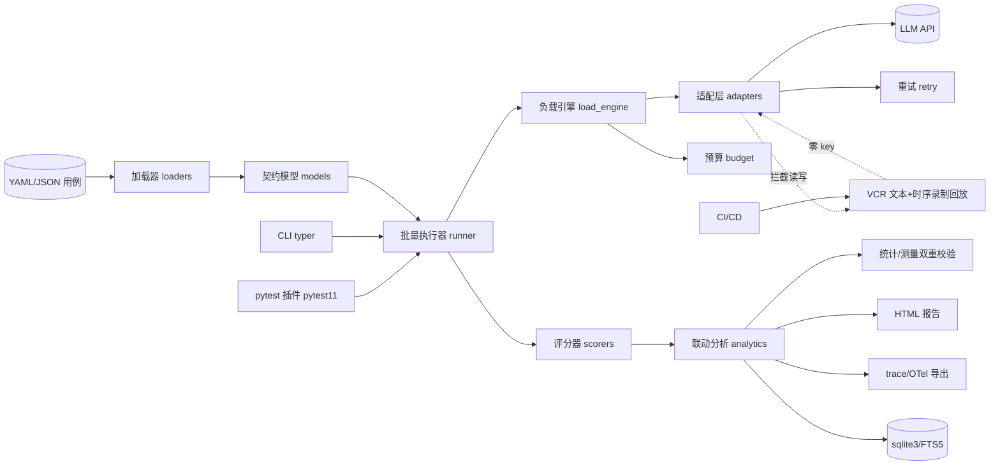
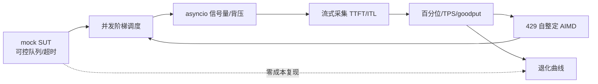
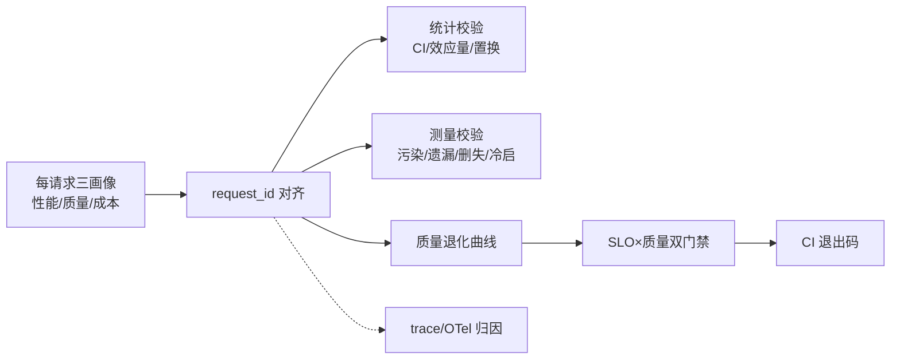
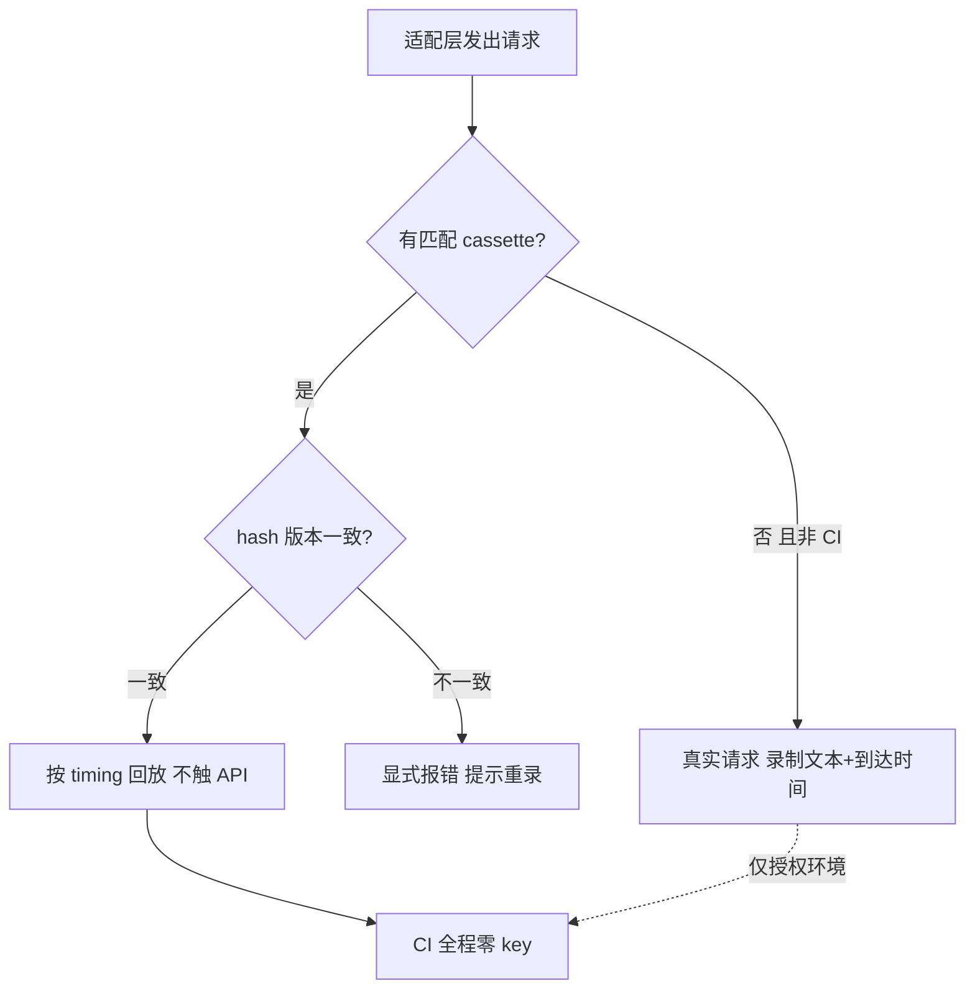
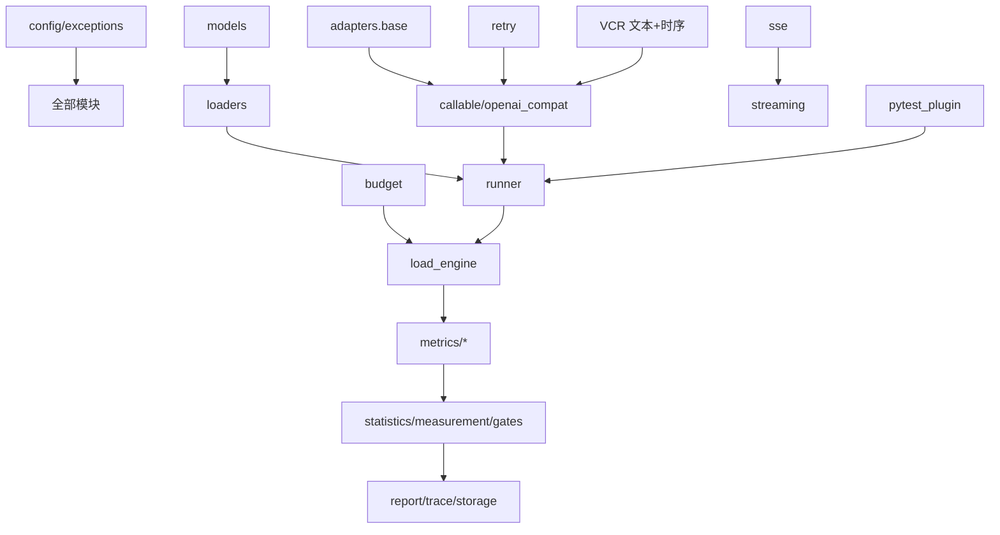

# AquaMind 项目开发计划 v1.0（94 天连续执行 · 证据脊梁版）

> 生效日期：2026-09-28；**AM-Day1 = 2026-09-29，AM-Day94 = 2026-12-31**。
> 本文件是执行的**唯一追踪依据**，只记录工程内容：定位、选型、架构、模块、里程碑、ADR 索引、变更记录。
> 开发方式：AI 全流程协作，94 天连续执行，每天一个可独立交付、可检验的小模块，周末不跳过。

## 项目定位

AquaMind 是**功能质量 + 非功能质量一体化的 LLM 应用测试工具**（库/CLI 形态，不做账号体系与协作平台）：

- 功能质量：精确匹配评分 + LLM-as-Judge（结构化 rubric），覆盖单轮/多轮/工具调用；
- 非功能旗舰：**负载下的质量退化测试**——并发阶梯负载下，延迟、质量、成本三条曲线联合分析与双门禁判定；
- 差异化边界（2026-09 核实）：**并发阶梯实验设计 + 退化统计与测量双重校验 + 时序保真 cassette + 公开退化数据集**；
- 明确非目标：红队攻击库不进产品代码（OWASP 检测笔记列入 2027Q1 维护期）、不做语义嵌入评分、不做多租户 SaaS、不绑定单一模型厂商。

## 工时口径

| 里程碑 | 开发模块日（含验收） | 联调缓冲 | 集成测试 | 博客 | 机动 | 总天数 | 起止日期 | AM-Day 范围 | 核心开发工时 |
|---|---|---|---|---|---|---|---|---|---|
| M1 底座 | 15 | 0 | 1 | 0 | 2 | 18 | 2026-09-29 ~ 2026-10-16 | AM-Day1~18 | 48-53h |
| M2 功能基线 | 8 | 0 | 0 | 0 | 0 | 8 | 2026-10-17 ~ 2026-10-24 | AM-Day19~26 | 28-33h |
| M3 负载引擎（旗舰） | 13 | 3 | 1 | 3 | 2 | 22 | 2026-10-25 ~ 2026-11-15 | AM-Day27~48 | 50-55h |
| M4 联动分析（旗舰） | 19 | 2 | 1 | 3 | 3 | 28 | 2026-11-16 ~ 2026-12-13 | AM-Day49~76 | 58-68h |
| M5 持久化与 SUT | 7 | 0 | 1 | 0 | 1 | 9 | 2026-12-14 ~ 2026-12-22 | AM-Day77~85 | 20-25h |
| M6 打磨交付 | 8 | 0 | 0 | 0 | 1 | 9 | 2026-12-23 ~ 2026-12-31 | AM-Day86~94 | 22-27h |
| **合计** | **70** | **5** | **4** | **6** | **9** | **94** | 2026-09-29 ~ 2026-12-31 | **AM-Day1~94** | **226-261h** |

> 口径说明：① 6 个验收日均含在开发模块日内，不另计；② 226-261h 含测试，博客产物工时另计；③ 9 个机动日中 **3 天预埋为休息日**（AM-Day38/AM-Day52/AM-Day73），6 天为延期吸收；④ M2 无独立集成日（端到端并入 AM-Day26 验收）；⑤ OWASP 检测笔记不占开发期，列入 2027Q1 维护期。

## 全周期每日模块总览（94 天连续）

**用法**：每天按日期查 AM-Day N 与对应任务，再到里程碑章节看细化条目。类型：开发 / 联调缓冲 / 集成测试 / 博客 / 机动。

| AM-Day | 日期 | 类型 | 模块编号 | 名称/内容 | 里程碑 | 深度标记 |
|---|---|---|---|---|---|---|
| 1 | 2026-09-29 | 开发 | M1-D01 | 配置与异常体系 | M1 底座 | — |
| 2 | 2026-09-30 | 开发 | M1-D02 | 用例契约模型 | M1 底座 | — |
| 3 | 2026-10-01 | 开发 | M1-D03 | YAML/JSON 双加载器 | M1 底座 | — |
| 4 | 2026-10-02 | 开发 | M1-D04 | 适配基类 + Callable 适配 | M1 底座 | — |
| 5 | 2026-10-03 | 开发 | M1-D05 | OpenAI 兼容适配·非流式 | M1 底座 | — |
| 6 | 2026-10-04 | 开发 | M1-D06a | VCR 文本录制·hash 版本 | M1 底座 | 深度·三个一 |
| 7 | 2026-10-05 | 开发 | M1-D06b | chunk 到达时间录制（timing 字段） | M1 底座 | 深度·三个一 |
| 8 | 2026-10-06 | 开发 | M1-D06c | 时序调度回放（加速/减速倍率） | M1 底座 | 深度·三个一 |
| 9 | 2026-10-07 | 开发 | M1-D07 | 重试退避与错误分类 | M1 底座 | — |
| 10 | 2026-10-08 | 开发 | M1-D08 | 预算熔断 | M1 底座 | — |
| 11 | 2026-10-09 | 开发 | M1-D09 | SSE 帧解析器 | M1 底座 | — |
| 12 | 2026-10-10 | 开发 | M1-D10 | 流式采集骨架 | M1 底座 | 深度·三个一 |
| 13 | 2026-10-11 | 开发 | M1-D11 | OpenAI 流式适配 | M1 底座 | — |
| 14 | 2026-10-12 | 开发 | M1-D12 | CLI `run` 集成 | M1 底座 | — |
| 15 | 2026-10-13 | 集成测试 | — | M1 最小链路端到端联调 | M1 底座 | — |
| 16 | 2026-10-14 | 开发 | M1-D13 | M1 验收缓冲（**覆盖率门禁 50%**） | M1 底座 | — |
| 17 | 2026-10-15 | 机动 | — | M1 机动（可后移） | M1 底座 | — |
| 18 | 2026-10-16 | 机动 | — | M1 机动（可后移） | M1 底座 | — |
| 19 | 2026-10-17 | 开发 | M2-D01 | 批量执行器 | M2 功能基线 | 深度·三个一 |
| 20 | 2026-10-18 | 开发 | M2-D02 | 精确匹配评分器 | M2 功能基线 | — |
| 21 | 2026-10-19 | 开发 | M2-D03 | 评分注册表 | M2 功能基线 | — |
| 22 | 2026-10-20 | 开发 | M2-D04 | Judge 评分器 | M2 功能基线 | 深度·三个一 |
| 23 | 2026-10-21 | 开发 | M2-D05 | Judge 韧性 + 同题波动 | M2 功能基线 | — |
| 24 | 2026-10-22 | 开发 | M2-D06 | Agent 用例与断言 | M2 功能基线 | — |
| 25 | 2026-10-23 | 开发 | M2-D07 | 批量评分接入 CI（回放路径） | M2 功能基线 | — |
| 26 | 2026-10-24 | 开发 | M2-D08 | M2 验收（端到端并入；**覆盖率门禁 65%**） | M2 功能基线 | — |
| 27 | 2026-10-25 | 开发 | M3-D01 | mock SUT | M3 负载引擎（旗舰） | 深度·三个一 |
| 28 | 2026-10-26 | 联调缓冲 | M3-D01 | mock SUT 联调缓冲 | M3 负载引擎（旗舰） | — |
| 29 | 2026-10-27 | 开发 | M3-D02 | 并发阶梯调度器 | M3 负载引擎（旗舰） | 深度·三个一 |
| 30 | 2026-10-28 | 开发 | M3-D03 | 负载模型 | M3 负载引擎（旗舰） | — |
| 31 | 2026-10-29 | 开发 | M3-D04 | asyncio 并发控制 | M3 负载引擎（旗舰） | 深度·三个一 |
| 32 | 2026-10-30 | 开发 | M3-D05 | 流式指标采集 | M3 负载引擎（旗舰） | — |
| 33 | 2026-10-31 | 开发 | M3-D06 | 百分位引擎 | M3 负载引擎（旗舰） | — |
| 34 | 2026-11-01 | 开发 | M3-D07 | TPS 引擎 | M3 负载引擎（旗舰） | 深度·三个一 |
| 35 | 2026-11-02 | 开发 | M3-D08 | goodput 口径 | M3 负载引擎（旗舰） | — |
| 36 | 2026-11-03 | 开发 | M3-D09 | 429 自整定 AIMD | M3 负载引擎（旗舰） | 深度·三个一 |
| 37 | 2026-11-04 | 联调缓冲 | M3-D09 | 429 自整定联调缓冲 | M3 负载引擎（旗舰） | — |
| 38 | 2026-11-05 | 机动·休息日 | — | 预埋休息日（M3 攻坚后恢复） | M3 负载引擎（旗舰） | — |
| 39 | 2026-11-06 | 开发 | M3-D10 | 限流退避联动 | M3 负载引擎（旗舰） | — |
| 40 | 2026-11-07 | 开发 | M3-D11 | 负载参数矩阵 | M3 负载引擎（旗舰） | 深度（并入总报告） |
| 41 | 2026-11-08 | 开发 | M3-D12 | 退化曲线复现 | M3 负载引擎（旗舰） | 深度·三个一 |
| 42 | 2026-11-09 | 联调缓冲 | M3-D12 | 退化曲线复现联调缓冲 | M3 负载引擎（旗舰） | — |
| 43 | 2026-11-10 | 集成测试 | — | M3 负载引擎端到端联调 | M3 负载引擎（旗舰） | — |
| 44 | 2026-11-11 | 博客 | M3-D02 | 博客：并发阶梯实验设计 | M3 负载引擎（旗舰） | 深度·三个一 |
| 45 | 2026-11-12 | 博客 | M3-D09 | 博客：AIMD 收敛分析 | M3 负载引擎（旗舰） | 深度·三个一 |
| 46 | 2026-11-13 | 博客 | M3-D12 | 博客：退化曲线方法论 | M3 负载引擎（旗舰） | 深度·三个一 |
| 47 | 2026-11-14 | 开发 | M3-D13 | M3 验收缓冲（覆盖率维持 65%） | M3 负载引擎（旗舰） | — |
| 48 | 2026-11-15 | 机动 | — | M3 机动（延期吸收） | M3 负载引擎（旗舰） | — |
| 49 | 2026-11-16 | 开发 | M4-D01 | 三画像对齐 | M4 联动分析（旗舰） | — |
| 50 | 2026-11-17 | 开发 | M4-D02 | 质量退化曲线 | M4 联动分析（旗舰） | 深度·三个一 |
| 51 | 2026-11-18 | 开发 | M4-D03 | 尾延迟段质量 | M4 联动分析（旗舰） | 深度·三个一 |
| 52 | 2026-11-19 | 机动·休息日 | — | 预埋休息日（M4 中段恢复） | M4 联动分析（旗舰） | — |
| 53 | 2026-11-20 | 开发 | M4-D04+05 | 成本曲线与负载-质量相关性汇总（合并） | M4 联动分析（旗舰） | — |
| 54 | 2026-11-21 | 开发 | M4-D06 | 双门禁联合判定 | M4 联动分析（旗舰） | 深度·三个一 |
| 55 | 2026-11-22 | 开发 | M4-D07 | CI 门禁退出码 | M4 联动分析（旗舰） | — |
| 56 | 2026-11-23 | 开发 | M4-D08a | trace 自研 schema JSON 导出 | M4 联动分析（旗舰） | 深度·三个一 |
| 57 | 2026-11-24 | 开发 | M4-D08b | OTel GenAI 语义约定导出 | M4 联动分析（旗舰） | 深度·三个一 |
| 58 | 2026-11-25 | 联调缓冲 | M4-D08 | trace/OTel 联调缓冲 | M4 联动分析（旗舰） | — |
| 59 | 2026-11-26 | 开发 | M4-S1 | 统计有效性①：bootstrap 置信区间 | M4 联动分析（旗舰） | 深度·三个一 |
| 60 | 2026-11-27 | 开发 | M4-S2 | 统计有效性②：重复测量噪声基线 | M4 联动分析（旗舰） | 深度·三个一 |
| 61 | 2026-11-28 | 开发 | M4-S3 | 统计有效性③：效应量/等价区间 | M4 联动分析（旗舰） | 深度·三个一 |
| 62 | 2026-11-29 | 开发 | M4-S4 | 统计有效性④：配对/置换检验 | M4 联动分析（旗舰） | 深度·三个一 |
| 63 | 2026-11-30 | 开发 | M4-S5 | 测量有效性①：循环滞后自校准 | M4 联动分析（旗舰） | 深度·三个一 |
| 64 | 2026-12-01 | 开发 | M4-S6 | 测量有效性②：协调遗漏报告 | M4 联动分析（旗舰） | 深度·三个一 |
| 65 | 2026-12-02 | 开发 | M4-S7 | 测量有效性③：截尾分离统计 | M4 联动分析（旗舰） | 深度·三个一 |
| 66 | 2026-12-03 | 开发 | M4-S8 | 测量有效性④：冷启动分离与预热 | M4 联动分析（旗舰） | 深度·三个一 |
| 67 | 2026-12-04 | 开发 | M4-D09a | 自包含 HTML 报告（上：结构/三曲线） | M4 联动分析（旗舰） | 深度·三个一 |
| 68 | 2026-12-05 | 开发 | M4-D09b | 自包含 HTML 报告（下：交互/门禁表） | M4 联动分析（旗舰） | — |
| 69 | 2026-12-06 | 集成测试 | — | M4 三曲线+双门禁端到端联调 | M4 联动分析（旗舰） | — |
| 70 | 2026-12-07 | 博客 | M4-S5 | 博客：统计与测量有效性方法 | M4 联动分析（旗舰） | 深度·三个一 |
| 71 | 2026-12-08 | 博客 | M4-D06 | 博客：双门禁判定框架 | M4 联动分析（旗舰） | 深度·三个一 |
| 72 | 2026-12-09 | 博客 | M4-D01 | 博客：三曲线联动分析 | M4 联动分析（旗舰） | 深度·三个一 |
| 73 | 2026-12-10 | 机动·休息日 | — | 预埋休息日（M4 攻坚后恢复） | M4 联动分析（旗舰） | — |
| 74 | 2026-12-11 | 开发 | M4-D10 | M4 验收（**覆盖率门禁 75%**） | M4 联动分析（旗舰） | — |
| 75 | 2026-12-12 | 联调缓冲 | M4-S5 | 统计/测量证据链联调缓冲 | M4 联动分析（旗舰） | — |
| 76 | 2026-12-13 | 机动 | — | M4 机动（延期吸收） | M4 联动分析（旗舰） | — |
| 77 | 2026-12-14 | 开发 | M5-D01 | sqlite schema/仓储（含 FTS5） | M5 持久化与 SUT | — |
| 78 | 2026-12-15 | 开发 | M5-D02 | 运行历史落库 | M5 持久化与 SUT | — |
| 79 | 2026-12-16 | 开发 | M5-D03 | 两次运行版本对比 | M5 持久化与 SUT | — |
| 80 | 2026-12-17 | 开发 | M5-D04 | 质量趋势线 | M5 持久化与 SUT | — |
| 81 | 2026-12-18 | 开发 | M5-D05 | 最小 RAG demo SUT（FTS5 检索） | M5 持久化与 SUT | 验证用 SUT |
| 82 | 2026-12-19 | 集成测试 | — | M5 持久化+SUT 端到端联调 | M5 持久化与 SUT | — |
| 83 | 2026-12-20 | 机动 | — | 机动（延期吸收/观测前缓冲） | M5 持久化与 SUT | — |
| 84 | 2026-12-21 | 开发 | M5-D06 | 真实端点观测 3 档×1（预热后测） | M5 持久化与 SUT | 深度·三个一 |
| 85 | 2026-12-22 | 开发 | M5-D07 | M5 验收（覆盖率维持 75%） | M5 持久化与 SUT | — |
| 86 | 2026-12-23 | 开发 | M6-P1 | pytest 插件骨架+pytest11+marker | M6 打磨交付 | 深度·三个一 |
| 87 | 2026-12-24 | 开发 | M6-P2 | fixture/异步事件循环/collection hook | M6 打磨交付 | 深度·三个一 |
| 88 | 2026-12-25 | 开发 | M6-P3 | --aquamind-report 选项/退出码/CI 验证 | M6 打磨交付 | 深度·三个一 |
| 89 | 2026-12-26 | 开发 | M6-D01 | 覆盖率 75→80 最后 5 个点 | M6 打磨交付 | — |
| 90 | 2026-12-27 | 开发 | M6-D02 | 中文文档与 API 参考 | M6 打磨交付 | — |
| 91 | 2026-12-28 | 开发 | M6-D03 | ADR 补齐（5-8 篇） | M6 打磨交付 | — |
| 92 | 2026-12-29 | 开发 | M6-D04 | 打包与 PyPI 发布（OIDC） | M6 打磨交付 | — |
| 93 | 2026-12-30 | 开发 | M6-D05 | 外部试用启动 | M6 打磨交付 | — |
| 94 | 2026-12-31 | 机动 | — | M6 验收 + 全局机动（可提前结束） | M6 打磨交付 | — |

## 全局强制规则

1. **VCR 文本录制回放（含时序）**：cassette 同时录制请求/响应 JSON、**hash 版本字段**与 **chunk 到达时间（timing）**；回放优先；支持加速/减速倍率；hash 不匹配显式报错；兼容无时序旧格式（按瞬时回放）。
2. **CI 零 key**：所有 CI 任务只走 mock SUT + 回放（含时序回放），不触真实 API。
3. **真实端点**：仅 M5-D06（**2026-12-21**）做一次观测，限 **3 档 × 1 次**，预热后测、放空闲时段；数据按三层数据源标注（**mock 受控 / real-live 真实直录 / real-replay 真实时序回放**）分区入库，真实 cassette 回放用于统计口径复核。
4. **mock SUT**：M3 第一天交付（2026-10-25），可控队列/超时，零成本稳定复现退化曲线。
5. **Agent 轻量（≤12h）**：多轮 messages + 工具调用期望；断言按 **参数 > 顺序 > 工具** 组织。
6. **M5 瘦身**：检索用 sqlite FTS5（不手写 BM25 公式、不引入 Chroma，Chroma 列 backlog）；RAG demo 为**验证框架通用性的最小 SUT**，不是深度模块。
7. **深度模块"三个一"**：一组量化数字（必须带**置信区间**并通过**测量有效性**校验）+ 一篇方法论博客（掘金/知乎）+ 一个可演示产物。
8. **统计 + 测量双重校验**：旗舰结论必须同时给出点估计、置信区间、效应量，并排除 GIL 测量污染、协调遗漏、删失偏差、冷启动四类伪源；仅描述性数字不构成结论。
9. **覆盖率增量门禁**：M1→50%、M2→65%、M4→75%、M6→80%，各里程碑验收日硬卡。
10. **pytest 插件优先**：采纳顺序 plugin > CLI > library；用户不改动现有测试即可使用。
11. 工具库（httpx/pydantic/typer）只做到**会用**，不做深。
12. OWASP 检测笔记列入 **2027Q1 维护期**，不占开发工时。

---

# 第 0 章：架构与原理图

## 0.1 系统架构图



## 0.2 图 A：负载引擎工作原理



## 0.3 图 B：双重校验与双门禁原理



## 0.4 图 C：VCR 时序保真与 CI 零 key 原理



## 0.5 模块依赖图



---

# M1 底座（AM-Day1~18，2026-09-29 ~ 2026-10-16）

> 验收（AM-Day16）：适配器切换 2 端点（含本地 mock）；429/超时分类单测通过；CLI 退出码正确；时序回放可复跑；**覆盖率门禁 50%**。

### M1-D01｜配置与异常体系（AM-Day1，2026-09-29）
- **文件**：`src/aquamind/config.py`、`src/aquamind/exceptions.py`
- **类/函数**：
  - `Settings.load()`：pydantic-settings 读 `AQ_` 前缀环境变量，含默认值
  - `AquaMindError.__init__(message, context: dict)`：异常基类
  - 子类：`ConfigError` `LoaderError` `AdapterError` `ReplayError` `BudgetError`
- **测试**（tests/test_config.py、test_exceptions.py）：缺省值；环境变量覆盖；非法值拒绝；异常携带 context
- **检验**：缺省配置可用；坏值被拒

### M1-D02｜用例契约模型（AM-Day2，2026-09-30）
- **文件**：`models/testcase.py`、`models/__init__.py`
- **类/函数**：`TestCase`（input/context/expected/score_tags/weights）；`ExpectedSpec`；`ScoreTag`
- **测试**：合法最小用例；缺必填被拒且定位字段；权重非负
- **检验**：坏数据报错指向具体字段

### M1-D03｜YAML/JSON 双加载器（AM-Day3，2026-10-01）
- **文件**：`src/aquamind/loaders.py`
- **函数**：`load_cases(path) -> list[TestCase]`；`_parse_yaml/_parse_json`；`_report_error(file, line, msg)`
- **测试**：双格式正常；坏 YAML 报行列号；空文件异常
- **检验**：坏文件报错含行列号

### M1-D04｜适配基类 + Callable 适配（AM-Day4，2026-10-02）
- **文件**：`adapters/base.py`、`adapters/callable.py`、`adapters/__init__.py`
- **类/函数**：`BaseAdapter.acomplete(messages, stream=False)`（抽象）；`CallableAdapter(fn)`
- **测试**：本地函数调用；抽象类不可实例化；返回结构归一
- **检验**：本地函数跑通一次调用

### M1-D05｜OpenAI 兼容适配·非流式（AM-Day5，2026-10-03）
- **文件**：`adapters/openai_compat.py`
- **类/函数**：`OpenAICompatAdapter(base_url, api_key, model, timeout)`；`acomplete()`；`_normalize_response()`
- **测试**：mock server 成功路径；401/500 分类异常；超时
- **检验**：mock 下单测通过，不触真实 API

### M1-D06a/b/c｜VCR 文本 + 时序录制回放（AM-Day6~8，2026-10-04~06）— 深度·三个一
- **文件**：`src/aquamind/replay.py`
- **三日交付**：
  - D6a：`Cassette`（请求指纹/响应体/**hash 版本字段**）；`record/find_match/play()`
  - D6b：每 **chunk 到达时间录制**，cassette 增加 `timing` 字段
  - D6c：**时序调度回放**（按录下时间调度，支持加速/减速倍率；旧格式瞬时回放）
- **测试**：录制后离线回放一致；无匹配异常；hash 不符报错；时序回放偏差；倍率加速/减速；旧格式兼容
- **三个一**：scripts/replay_baseline.json（回放一致率/时序偏差）；博客素材并入 M4 有效性复盘；examples/replay_demo/（含时序 cassette）
- **决策 ADR**：时序保真回放的设计决策与边界
- **检验**：离线回放文本与时序均可复现；hash 不匹配报错

### M1-D07｜重试退避与错误分类（AM-Day9，2026-10-07）
- **文件**：`src/aquamind/retry.py`
- **类/函数**：`ErrorKind`；`classify_error(exc)`；`with_retry(coro_factory, max_retries, base, jitter)`
- **测试**：429/5xx/超时退避；AUTH 不重试
- **检验**：三类故障按策略重试

### M1-D08｜预算熔断（AM-Day10，2026-10-08）
- **文件**：`src/aquamind/budget.py`
- **类/函数**：`Budget(max_tokens, max_cost)`；`consume()`；`BudgetExceeded`
- **测试**：未超正常；达阈值熔断；并发消费不超额
- **检验**：达阈值快速失败

### M1-D09｜SSE 帧解析器（AM-Day11，2026-10-09）
- **文件**：`src/aquamind/sse.py`
- **函数**：`parse_sse_stream(iterator) -> AsyncIterator[SSEEvent]`；`parse_event(raw)`
- **测试**：标准帧；注释帧；多 data 行；断帧；方言字段
- **检验**：多组样例对拍通过

### M1-D10｜流式采集骨架（AM-Day12，2026-10-10）— 深度·三个一
- **文件**：`src/aquamind/streaming.py`
- **类/函数**：`StreamRecord`（ttft/itls/总时长/结束状态）；`collect_stream(event_iter, timer)`
- **测试**：单 token TTFT；多 token ITL；断流标记；与手算一致
- **三个一**：scripts/streaming_baseline.json；博客素材（并入 M4 有效性复盘）；examples/streaming_demo
- **检验**：mock 流上数字与手算一致

### M1-D11｜OpenAI 流式适配（AM-Day13，2026-10-11）
- **文件**：`adapters/openai_compat.py`（扩展）
- **函数**：`astream()` 流式端点 → sse.parse → token 流
- **测试**：完整流；中途 [DONE]；断连边界
- **检验**：mock SSE 下完整流式返回

### M1-D12｜CLI `run` 集成（AM-Day14，2026-10-12）
- **文件**：`src/aquamind/cli.py`
- **函数**：`run(target, count, stream)`；退出码映射
- **测试**：runner 调起；缺文件非 0；正常退出 0
- **检验**：mock 下命令跑通

### M1-INT｜集成测试（AM-Day15，2026-10-13）
- **交付**：tests/integration/test_minimal_flow.py（加载→适配→执行→输出）
- **检验**：端到端绿

### M1-D13｜M1 验收（AM-Day16，2026-10-14）
- **验收清单**：① 两适配可切换；② 429/5xx/超时分类全绿；③ CLI 退出码正确；④ cassette hash + timing 生效；⑤ CI 零 key；⑥ 最小链路集成通过；⑦ **覆盖率 ≥50% 硬门禁**

### M1-FLX｜机动（AM-Day17~18，2026-10-15~16）
- 吸收延期；未使用后移

---

# M2 功能基线（AM-Day19~26，2026-10-17 ~ 2026-10-24）

> 验收（AM-Day26）：10 条用例输出分数+理由；两类评分器全绿；端到端并入验收；CI 零 key；**覆盖率门禁 65%**。

### M2-D01｜批量执行器（AM-Day19，2026-10-17）— 深度·三个一
- **文件**：`src/aquamind/runner.py`
- **类/函数**：`BatchRunner(adapter, max_concurrency)`；`run(cases) -> BatchResult`；信号量控并发；失败隔离
- **测试**：全部成功；部分失败出部分报告；并发上限；token/成本字段
- **三个一**：scripts/batch_baseline.json；博客素材（并入 M4 复盘）；examples/batch_demo
- **检验**：部分失败产出部分报告

### M2-D02｜精确匹配评分器（AM-Day20，2026-10-18）
- **文件**：`scorers/exact_match.py`
- **类/函数**：`ExactMatchScorer`；五类断言 `regex/contains/excludes/keywords/json_parseable`
- **测试**：每类通过/失败；组合断言；非法 JSON
- **检验**：各断言对拍通过

### M2-D03｜评分注册表（AM-Day21，2026-10-19）
- **文件**：`scorers/registry.py`
- **函数**：`register()`；`get_scorer()`；`list_scorers()`
- **测试**：按名调用；重名策略；未知名报错
- **检验**：注册后可按名调用

### M2-D04｜Judge 评分器（AM-Day22，2026-10-20）— 深度·三个一
- **文件**：`scorers/judge.py`
- **类/函数**：`JudgeScorer(adapter, rubric)`；`score()` 取结构化 JSON（score/reason）；裁判端点强制不同族
- **测试**：分数与理由落库；同族裁判被拒；缺字段处理
- **三个一**：scripts/judge_baseline.json；博客素材（并入 M4 复盘）；examples/judge_demo
- **检验**：mock 下分数与理由正确

### M2-D05｜Judge 韧性 + 同题波动（AM-Day23，2026-10-21）
- **文件**：`scorers/judge.py`（扩展）
- **函数**：解析失败重试，耗尽落 `UNJUDGEABLE`；`fluctuation_interval()`
- **测试**：坏 JSON 落不可判；n 次波动区间；空序列
- **检验**：坏 JSON 不崩

### M2-D06｜Agent 用例与断言（AM-Day24，2026-10-22）
- **文件**：`models/agent_case.py`
- **类/函数**：`AgentCase(messages, tool_calls)`；`ToolCallExpect(name, args, order)`；`assert_args/assert_order/assert_tools`
- **测试**：参数匹配；顺序错乱；工具缺失（三层失败信息各自准确）
- **检验**：三层断言失败信息准确

### M2-D07｜批量评分接入 CI（AM-Day25，2026-10-23）
- **文件**：`runner.py`（回放接入）、`.github/workflows/ci.yml`
- **函数**：CI 路径强制回放；cassette 缺失直接失败
- **测试**：无真实 API 批量评分；缺 key 不报错
- **检验**：CI 无真实 API 批量评分全绿

### M2-D08｜M2 验收（AM-Day26，2026-10-24）
- **验收清单**（端到端并入本日）：① 10 条用例分数+理由可复跑；② 五类断言与 Judge 全绿；③ 坏 JSON 落不可判；④ Agent 三层断言正确；⑤ CI 零 key；⑥ 批量评分端到端通过；⑦ **覆盖率 ≥65% 硬门禁**

---

# M3 负载引擎（旗舰，AM-Day27~48，2026-10-25 ~ 2026-11-15）

> 验收（AM-Day47）：mock SUT 复现退化曲线；并发阶梯正常；百分位/TPS/goodput 可复现。

### M3-D01｜mock SUT（AM-Day27，2026-10-25）— 深度·三个一
- **文件**：`sut/mock_server.py`、`sut/__init__.py`
- **类/函数**：`MockSUT(queue_depth, serve_delay, timeout, drop_rate)`；SSE 端点按队列参数产出延迟与丢字
- **测试**：默认零排队；大队列尾延迟；超时/丢字生效
- **三个一**：scripts/mock_sut_curve.json；博客《零成本造退化：可控队列 mock SUT 设计》并入 M4 复盘；一键启动脚本
- **检验**：参数可稳定造出尾延迟升高

### M3-BUF1｜mock SUT 联调缓冲（AM-Day28，2026-10-26）
- 队列/超时行为与记录落盘修复；三档参数切换符合预期

### M3-D02｜并发阶梯调度器（AM-Day29，2026-10-27）— 深度·三个一
- **文件**：`src/aquamind/load_engine.py`
- **函数**：`run_sweep(levels, hold_seconds, cooldown)`；`_run_level(n)`
- **设计约束（关键）**：**开环负载——恒定到达率驱动，不做闭环调节（在途并发自适应）**；闭环会让慢响应自动降低到达率、掩盖排队效应，使 S5-S8 证据链失效
- **测试**：档序；cooldown；空/单档；各档在途数
- **三个一**：阶梯执行日志；博客《并发阶梯实验设计》；examples/sweep_demo
- **检验**：各档并发数精确

### M3-D03｜负载模型（AM-Day30，2026-10-28）
- **文件**：`load_engine.py`（负载模型部分）
- **类/函数**：`LoadProfile(ramp_up, ramp_down, think_time, input_len, output_len)`
- **测试**：参数可配；抽样分布；ramp 边界
- **检验**：抽样符合设定

### M3-D04｜asyncio 并发控制（AM-Day31，2026-10-29）— 深度·三个一
- **文件**：`src/aquamind/concurrency.py`
- **类/函数**：`BoundedSemaphoreRunner(n)`；背压入队；`cancel_all()`；异常聚合
- **测试**：并发上限；取消无孤儿；异常不丢；排队顺序
- **三个一**：并发控制指标；博客素材；examples/concurrency_demo
- **检验**：取消后无孤儿任务

### M3-D05｜流式指标采集（AM-Day32，2026-10-30）
- **文件**：`metrics/stream_metrics.py`
- **类/函数**：`RequestMetric(request_id, ttft, itls, status, finished, started_at, ended_at)`——**逐请求持久化 monotonic 起止时间戳（started_at/ended_at）**，作为 M4-S5/S6 的数据前提（避免后期回改 M3 代码）
- **测试**：字段完整；断流标记；request_id 唯一；时间戳单调性与来源（monotonic）校验
- **检验**：mock 下与手算一致；时间戳可支撑 S5/S6 复算

### M3-D06｜百分位引擎（AM-Day33，2026-10-31）
- **文件**：`metrics/percentiles.py`
- **函数**：`percentile(values, p)`；`percentile_table()`
- **测试**：奇偶样本；线性插值；边界；参考实现对拍
- **检验**：对拍一致

### M3-D07｜TPS 引擎（AM-Day34，2026-11-01）— 深度·三个一
- **文件**：`metrics/tps.py`
- **函数**：`tokens_per_second()`；总/每用户 TPS
- **测试**：定速流；失败计入规则；窗口边界
- **三个一**：scripts/tps_baseline.json；博客素材并入 M3 复盘；examples/tps_demo
- **检验**：定速流下数字正确

### M3-D08｜goodput 口径（AM-Day35，2026-11-02）
- **文件**：`metrics/goodput.py`
- **函数**：`goodput(records, slo)`；延迟/错误/超时/限流联合判定
- **测试**：全达标；单类违例；多类叠加
- **检验**：违例注入时占比正确

### M3-D09｜429 自整定 AIMD（AM-Day36，2026-11-03）— 深度·三个一
- **文件**：`src/aquamind/rate_control.py`
- **类/函数**：`AIMDController(max_n, floor)`；`on_rate_limited()`；`on_success()`
- **测试**：429 降半；持续成功回升；下限；响应头预判
- **三个一**：scripts/aimd_baseline.json；博客《AIMD 收敛分析》；examples/aimd_demo
- **检验**：注入 429 自动降并发并恢复

### M3-BUF2｜429 自整定联调缓冲（AM-Day37，2026-11-04）
- 连续 429 降至下限、成功后回升联动修复

### M3-REST｜预埋休息日（AM-Day38，2026-11-05）
- 攻坚后恢复，不安排开发任务

### M3-D10｜限流退避联动（AM-Day39，2026-11-06）
- **文件**：`rate_control.py`（扩展）
- **函数**：退避与重试预算协同；`next_delay(headers)`
- **测试**：retry-after；预算耗尽停止；不击穿供应商
- **检验**：限流场景不被持续拒绝

### M3-D11｜负载参数矩阵（AM-Day40，2026-11-07）
- **文件**：`src/aquamind/matrix.py`
- **类/函数**：`build_matrix(input_lens, levels, output_lens)`；参数快照
- **测试**：组合数；快照可追溯；重复运行指纹
- **检验**：每档与快照可查（并入旗舰总报告）

### M3-D12｜退化曲线复现（AM-Day41，2026-11-08）— 深度·三个一
- **文件**：`scripts/run_degradation.py`
- **函数**：mock SUT 全阶梯，延迟随并发曲线（3 次复测）
- **三个一**：scripts/degradation_curve.json；博客《退化曲线方法论》；现场退化演示
- **检验**：曲线稳定复现 3 次

### M3-BUF3｜退化曲线联调缓冲（AM-Day42，2026-11-09）
- 三次复测拐点一致性修复

### M3-INT｜集成测试（AM-Day43，2026-11-10）
- **交付**：tests/integration/test_load_engine_e2e.py
- **检验**：端到端绿且数字可复现

### M3-B1~B3｜博客（AM-Day44~46，2026-11-11~13）
- 依次发布：并发阶梯实验设计、AIMD 收敛分析、退化曲线方法论

### M3-D13｜M3 验收（AM-Day47，2026-11-14）
- **验收清单**：① mock SUT 稳定复现尾延迟；② 阶梯调度与负载模型正确；③ p50/p95/p99/TPS/goodput 对拍一致；④ AIMD 升降有效；⑤ 参数矩阵可追溯；⑥ CI 零 key 跑通 M3 子集；⑦ 端到端集成通过

### M3-FLX｜机动（AM-Day48，2026-11-15）
- 旗舰延期吸收；未使用后移

---

# M4 联动分析（旗舰，AM-Day49~76，2026-11-16 ~ 2026-12-13）

> 验收（AM-Day74）：三曲线报告；双门禁正确；trace/OTel 可查；统计 S1-S4 + 测量 S5-S8 八项证据落地；HTML 断网可开；**覆盖率门禁 75%**。

### M4-D01｜三画像对齐（AM-Day49，2026-11-16）
- **文件**：`src/aquamind/analytics.py`
- **类/函数**：`RequestProfile(request_id, perf, quality, cost)`；`align_profiles()`
- **测试**：三源齐全；缺源标记；一对多处理
- **检验**：request_id 三画像齐全

### M4-D02｜质量退化曲线（AM-Day50，2026-11-17）— 深度·三个一
- **文件**：`analytics.py`（退化部分）
- **函数**：`quality_by_level()`；退化幅度 `delta`
- **测试**：已知分差幅度；空档处理
- **三个一**：scripts/quality_curve.json（**带置信区间**）；博客素材；examples/quality_curve_demo
- **检验**：注入已知分差时幅度正确

### M4-D03｜尾延迟段质量（AM-Day51，2026-11-18）— 深度·三个一
- **文件**：`analytics.py`（分段部分）
- **函数**：`tail_segments(profiles, boundaries)`；段均分对比
- **测试**：分段归属；边界规则；段间分差
- **三个一**：scripts/tail_quality.json；博客素材；examples/tail_demo
- **检验**：归属与分差正确

### M4-REST1｜预埋休息日（AM-Day52，2026-11-19）
- M4 攻坚中段恢复；原 M4-D04 成本曲线并入 M4-D05 合并交付（总量与验收口径不变）

### M4-D04+05｜成本曲线与负载-质量相关性汇总（AM-Day53，2026-11-20）
- **文件**：`analytics.py`（成本与汇总部分）
- **类/函数**：`cost_by_level()`；`cost_per_good_answer()`；`summarize_trend(curves)`
- **测试**：费用加总；单价口径；零合格处理；结论由数据生成；正负趋势；可复算
- **检验**：加总口径正确；结论可复算

### M4-D06｜双门禁联合判定（AM-Day54，2026-11-21）— 深度·三个一
- **文件**：`src/aquamind/gates.py`
- **类/函数**：`SLO(latency, error, timeout, rate_limit)`；`QualityGate(min_score)`；`evaluate(level, profiles) -> Verdict`
- **测试**：全达标；单指标越线定位；调差 mock 拦截
- **三个一**：scripts/gate_baseline.json；博客《双门禁判定框架》；examples/gate_demo
- **检验**：调差 mock 判不通过且定位准确

### M4-D07｜CI 门禁退出码（AM-Day55，2026-11-22）
- **文件**：`gates.py`（CLI 部分）
- **函数**：`gate_command(smoke_only=False)`；退出码 0/1
- **测试**：通过 0；失守 1；冒烟档低成本
- **检验**：门禁失败退出码非 0

### M4-D08a/b｜trace 自研 schema + OTel 导出（AM-Day56~57，2026-11-23~24）— 深度·三个一
- **文件**：`src/aquamind/trace.py`
- **两日交付**：
  - D08a：`export_trace(profiles) -> list[dict]`（schema 版本字段；`find_by_request_id()`）
  - D08b：**OTel GenAI 语义约定**格式导出（与自研格式同时输出）
- **测试**：字段齐；schema 版本；OTel 字段映射；检索；空集
- **三个一**：scripts/trace_baseline.json；博客素材（并入三曲线复盘）；examples/trace_demo
- **检验**：两种 JSON 可查字段齐

### M4-D08BUF｜trace/OTel 联调缓冲（AM-Day58，2026-11-25）
- 慢请求失分 join 修复；OTel 字段映射复核

### M4-S1｜bootstrap 置信区间（AM-Day59，2026-11-26）— 深度·三个一
- **文件**：`src/aquamind/statistics.py`
- **函数**：`bootstrap_ci(samples, stat, n_boot, confidence)`
- **测试**：已知分布覆盖率；种子可复现；极小样本降级
- **三个一**：scripts/bootstrap_baseline.json；博客《统计与测量有效性方法》；examples/bootstrap_demo
- **检验**：区间覆盖率对拍通过

### M4-S2｜重复测量噪声基线（AM-Day60，2026-11-27）— 深度·三个一
- **文件**：`statistics.py`（扩展）
- **函数**：`noise_baseline(repeats) -> (sigma, cv)`
- **测试**：定常/含噪样本；CV；空/单点
- **三个一**：scripts/noise_baseline.json；博客素材；examples/noise_demo
- **检验**：噪声数字与构造一致

### M4-S3｜效应量/等价区间（AM-Day61，2026-11-28）— 深度·三个一
- **文件**：`statistics.py`（扩展）
- **函数**：`cohens_d(a, b)`；`equivalence_interval()`（TOST）
- **测试**：已知均值差；小样本校正；区间判定
- **三个一**：scripts/effect_size.json；博客素材；examples/effect_demo
- **检验**：d 值与手算一致

### M4-S4｜配对/置换检验（AM-Day62，2026-11-29）— 深度·三个一
- **文件**：`statistics.py`（扩展）
- **函数**：`paired_test()`；`permutation_test(a, b, n_perm)`；`ordered_trend_test()`（Jonckheere-Terpstra）
- **设计约束**：有序档位统一用 Jonckheere-Terpstra 趋势检验，不做逐档两两比较（规避多重比较膨胀）
- **测试**：已知 p 值对拍；重采样数；单侧/双侧；趋势检验单调性对拍
- **三个一**：scripts/permutation_baseline.json；博客素材；examples/permutation_demo
- **检验**：p 值与参考实现对拍

### M4-S5｜循环滞后自校准（AM-Day63，2026-11-30）— 深度·三个一
- **文件**：`src/aquamind/measurement_validity.py`
- **类/函数**：后台 ticker 协程 `LoopLagMonitor()`；`lag_ceiling()` 输出当前并发下工具自身计时噪声底；低于底噪指标不报告
- **测试**：空载滞后；注入排队滞后抬升；底噪阈值；并发档曲线
- **三个一**：scripts/loop_lag_baseline.json；博客素材并入有效性方法；examples/lag_demo
- **检验**：注入滞后时底噪数字正确抬升

### M4-S6｜协调遗漏报告（AM-Day64，2026-12-01）— 深度·三个一
- **文件**：`measurement_validity.py`（扩展）
- **函数**：`target_vs_observed_concurrency()`；二者背离曲线
- **测试**：SUT 定速时一致；SUT 变慢时背离；无遗漏请求统计
- **三个一**：scripts/coordinated_omission.json；博客素材；examples/omission_demo
- **检验**：注入慢响应时实测在途并发如实下降

### M4-S7｜截尾分离统计（AM-Day65，2026-12-02）— 深度·三个一
- **文件**：`measurement_validity.py`（扩展）
- **函数**：`split_complete_vs_truncated()`；完整/截断/超时三组分开评分
- **测试**：全完整；注入超时/截断；三组分数分离
- **三个一**：scripts/censoring_baseline.json；博客素材；examples/censoring_demo
- **检验**：截断输出不被计入"质量退化"结论

### M4-S8｜冷启动分离与预热协议（AM-Day66，2026-12-03）— 深度·三个一
- **文件**：`measurement_validity.py`（扩展）
- **函数**：`warmup_protocol()`；冷启动数据标注/分离
- **测试**：预热后稳态；冷启动标注；二者不混写
- **三个一**：scripts/cold_start_baseline.json；博客素材；examples/cold_start_demo
- **检验**：冷启动数据被显式分离

### M4-D09a/b｜自包含 HTML 报告（AM-Day67~68，2026-12-04~05）
- **文件**：`src/aquamind/report.py`
- **函数**：`render_html(analytics, gates, trace, stats, measurement) -> str`；三曲线/门禁表/有效性摘要内联 SVG；零外链
- **测试**：断网打开；无外部资源；置信区间+底噪+截尾展示
- **检验**：断网双击可开、交互正常

### M4-INT｜集成测试（AM-Day69，2026-12-06）
- **交付**：tests/integration/test_m4_e2e.py（分析→统计→测量→门禁→报告）
- **检验**：调差 mock 全链正确

### M4-B1~B3｜博客（AM-Day70~72，2026-12-07~09）
- 依次发布：统计与测量有效性方法、双门禁判定框架、三曲线联动分析

### M4-REST2｜预埋休息日（AM-Day73，2026-12-10）
- M4 攻坚后恢复

### M4-D10｜M4 验收（AM-Day74，2026-12-11）
- **验收清单**：① 三画像对齐；② 三曲线带置信区间；③ 尾延迟段可对比；④ 双门禁正确拦截并指档位；⑤ 统计 S1-S4 全绿；⑥ 测量 S5-S8 全绿；⑦ trace/OTel 可查；⑧ HTML 断网可开；⑨ CI 退出码生效；⑩ CI 零 key；⑪ **覆盖率 ≥75% 硬门禁**

### M4-BUF｜统计/测量证据链联调缓冲（AM-Day75，2026-12-12）
- **任务**：S1-S8 统计与测量证据链在同一份数据上整体联调；遗留项收尾
- **检验**：八项证据（CI/噪声/效应量/置换 + 污染/遗漏/删失/冷启）复算结果一致

### M4-FLX｜机动（AM-Day76，2026-12-13）
- 延期吸收；未使用后移

---

# M5 持久化与 SUT（AM-Day77~85，2026-12-14 ~ 2026-12-22）

> 验收（AM-Day85）：sqlite 历史可查；对比/趋势正常；RAG demo 可跑；真实端点预热后 3 档×1 入库。

### M5-D01｜sqlite schema/仓储（含 FTS5）（AM-Day77，2026-12-14）
- **文件**：`src/aquamind/storage.py`
- **函数**：`init_db(path)`；runs/metrics/gates/snapshots 表；FTS5 虚表；`insert_run/get_run()`
- **测试**：建库幂等；增查；FTS5 检索；schema 版本
- **检验**：FTS5 索引可查

### M5-D02｜运行历史落库（AM-Day78，2026-12-15）
- **函数**：`save_run()`；`list_runs(page, size)`
- **测试**：分页；明细一致；空库
- **检验**：历史与明细可查

### M5-D03｜两次运行版本对比（AM-Day79，2026-12-16）
- **文件**：`src/aquamind/compare.py`
- **函数**：`diff_runs(run_a, run_b)`
- **测试**：增/减/不变；缺指标；顺序无关
- **检验**：diff 正确

### M5-D04｜质量趋势线（AM-Day80，2026-12-17）
- **文件**：`src/aquamind/trends.py`
- **函数**：`quality_trend(runs)`
- **测试**：序列一致；空/单点；时间排序
- **检验**：趋势正确

### M5-D05｜最小 RAG demo SUT（AM-Day81，2026-12-18）— 验证用 SUT
- **文件**：`sut/rag_demo.py`
- **类/函数**：`RAGDemo(fts_retriever, adapter)`；`answer()` FTS5 检索→拼上下文→兼容端点
- **测试**：端到端问答；无命中兜底；引用
- **检验**：端到端可跑（验证框架通用性，非深度模块）

### M5-INT｜集成测试（AM-Day82，2026-12-19）
- **交付**：tests/integration/test_m5_e2e.py
- **检验**：运行落库、对比、趋势全链

### M5-FLX｜机动（AM-Day83，2026-12-20）
- 延期吸收/观测前缓冲；预埋休息日调整至 M4 中段（AM-Day52）

### M5-D06｜真实端点观测 3 档×1（AM-Day84，2026-12-21）— 深度·三个一
- **文件**：`scripts/observe_real.py`
- **函数**：空闲时段授权端点预热后 3 档各 1 次；冷启动数据单独标注
- **三层数据源标注**：**mock 受控 / real-live 真实直录 / real-replay 真实时序回放**；真实 cassette 回放用于跑统计口径（回答"置信区间在 mock 上算的，对真实系统是否成立"）
- **三个一**：scripts/real_observation.json；博客素材（并入年度复盘）；可复跑配置
- **检验**：三层数据源分区入库不混写；真实回放可复算统计

### M5-D07｜M5 验收（AM-Day85，2026-12-22）
- **验收清单**：① 历史可查；② diff 正确；③ 趋势可见；④ FTS5 可跑；⑤ RAG demo 通；⑥ 真实端点 3 档×1 预热入库并按三层数据源标注分区；⑦ Chroma 仅在 backlog；⑧ 覆盖率维持 75%

---

# M6 打磨交付（AM-Day86~94，2026-12-23 ~ 2026-12-31）

> 含 pytest 插件 P1-P3 独立三日；验收+全局机动 AM-Day94。

### M6-P1｜pytest 插件骨架 + pytest11 + marker（AM-Day86，2026-12-23）— 深度·三个一
- **文件**：`src/aquamind/pytest_plugin.py`、`pyproject.toml`（pytest11 entry point）
- **内容**：插件可安装自动加载；`load/quality` 分层 marker 注册
- **测试**：安装后 pytest 识别 marker；pytest11 加载；未安装不报错
- **三个一**：scripts/pytest_plugin_baseline.json；博客素材；examples/plugin_demo
- **检验**：pytest 自动加载插件

### M6-P2｜fixture/异步事件循环/collection hook（AM-Day87，2026-12-24）— 深度·三个一
- **文件**：`pytest_plugin.py`（扩展）
- **内容**：fixture 生命周期；异步 marker 事件循环隔离；`pytest_collection_modifyitems` 动态收集
- **测试**：异步用例事件循环不冲突；fixture setup/teardown；收集顺序
- **三个一**：scripts/pytest_plugin_async.json；博客素材；examples/plugin_async_demo
- **决策 ADR**：为什么插件形态优先于 CLI 形态（plugin > CLI > library）
- **检验**：异步测试经插件稳定运行

### M6-P3｜--aquamind-report/退出码/CI 验证（AM-Day88，2026-12-25）— 深度·三个一
- **文件**：`pytest_plugin.py`（报告部分）
- **内容**：`--aquamind-report` 选项；自定义报告 hook；门禁退出码；CI 接入
- **测试**：加选项产出报告；失守退出非 0；CI 零 key 跑插件
- **三个一**：scripts/pytest_plugin_report.json；博客素材；examples/plugin_report_demo
- **检验**：`pytest --aquamind-report` 无需改用户测试即可用

### M6-D01｜覆盖率 75→80（AM-Day89，2026-12-26）
- 最后 5 个点补测；`--cov-fail-under=80`
- **检验**：CI 覆盖率硬门禁通过

### M6-D02｜中文文档与 API 参考（AM-Day90，2026-12-27）
- README：问题→naive 方案缺陷→竞品位置→架构→踩坑→量化结论；docs/api-reference.md
- **检验**：陌生读者可跑通最小链路

### M6-D03｜ADR 补齐（AM-Day91，2026-12-28）
- 5-8 篇（指标口径/双门禁/SUT 边界/限流/统计有效性/测量有效性/时序回放/trace）
- **检验**：每篇含决策/备选/边界

### M6-D04｜打包与 PyPI 发布（AM-Day92，2026-12-29）
- wheel 检查；Trusted Publishing（OIDC）独立 release 工作流
- **检验**：干净环境 wheel 安装 + 冒烟通过

### M6-D05｜外部试用启动（AM-Day93，2026-12-30）
- 发布说明与示例；目标 20+ 使用者 / 3+ 外部 issue
- **检验**：存在外部运行证据

### M6-D06｜M6 验收 + 全局机动（AM-Day94，2026-12-31）
- **验收清单**：① 覆盖率 ≥80%、双 OS CI 全绿；② 文档与 5-8 ADR；③ PyPI 发布；④ pytest 插件 P1-P3 可用；⑤ 冒烟通过；⑥ 试用启动；⑦ 带真实数字的中文复盘发布；剩余时间全局机动（可提前结束）

---

# 文件结构

```text
src/aquamind/
├── config.py / exceptions.py / loaders.py / replay.py / retry.py
├── budget.py / sse.py / streaming.py / runner.py / concurrency.py
├── load_engine.py / rate_control.py / matrix.py / analytics.py
├── gates.py / trace.py / report.py / storage.py / compare.py / trends.py
├── statistics.py / measurement_validity.py / pytest_plugin.py / cli.py
├── models/        testcase.py、agent_case.py
├── adapters/      base.py、callable.py、openai_compat.py
├── scorers/       exact_match.py、registry.py、judge.py
├── metrics/       stream_metrics.py、percentiles.py、tps.py、goodput.py
└── sut/           mock_server.py、rag_demo.py
tests/             单元 + integration/ 端到端
docs/              adr/、blog/、api-reference.md
scripts/           基线/观测脚本与 JSON 数字产物
examples/          各深度模块可运行示例
```

# 发布后维护：季度退化观测站（2027-2029）

> 项目发布后定位为**退化数据观测站**：不做高频依赖 bump，以季度为单位产出真实数据与报告，全年 6-12 次可技术验证的提交。

## 季度报告排期

| 报告 | 观测窗口 | 产物 |
|---|---|---|
| **2027Q1 退化报告**（含 **OWASP LLM Top10 检测笔记**、v1.0 发布） | 2027.01-03 | 数据集 + 博客 + release |
| 2027Q2 退化报告 | 2027.04-06 | 同上 |
| 2027Q3 退化报告 | 2027.07-09 | 同上 |
| 2027Q4 退化报告 | 2027.10-12 | 同上 |
| 2028Q1-Q4 | 每季度一次 | 同上 |
| **2029Q1 退化报告** | 2029.01-03 | 年度对比 + 当季数据（保证该季度仓库活跃） |

每次成本 1-2 天：固定测试集对当季主流模型跑阶梯负载 → 数据集追加 → 季度报告发布。

## 维护动作（6 项）

1. 重大版本跟随（全年 2-3 次真实提交）；
2. 外部 issue 48 小时内回应；
3. 季度 release note；
4. 公开 roadmap 更新；
5. 数据集季度更新；
6. **退化数据集同步发布到 Hugging Face Datasets**（2027Q1 起随季度报告更新；成本约半天，提升引用价值与可发现性）。

# 跟踪规则

1. 每完成一个模块：勾选 AM-Day N，小粒度 commit（信息含 AM-Day 与模块编号），禁止单个大 commit。
2. 深度模块完成当天：通过双重校验的量化数字入 scripts/，博客当周发布。
3. 里程碑验收日：按验收清单 + 覆盖率增量门禁逐项核验，全绿才进入下一里程碑。
4. 发布后按季度观测站节奏执行，不做无实质内容的提交。
5. 计划调整追加变更记录，不静默改表。

# 附录：技术验证（2026.09 全网资料）

## A. 技术栈生命周期（2026-2030）

| 技术栈 | 结论 | 依据 |
|---|---|---|
| Python 3.11+ | 稳定主流；free-threaded 自 3.14 起 asyncio 一等支持，增强非威胁 | Python 官方文档 |
| asyncio | 无替代范式；I/O 并发事实标准 | — |
| SSE 流式解析 | 2026.7 IETF 草案确认 OpenAI/Anthropic/Google 全走 HTTP/2+SSE | IETF draft-spk-agentproto |
| pytest | 事实标准，插件生态最大 | — |
| pydantic | 月下载 3.6 亿+，数据验证最主流 | — |
| OpenAI 兼容协议 | 事实标准，IETF 草案在收敛它 | IETF 草案 |
| sqlite3/FTS5、typer | 轻量持久化（含全文检索）与 CLI 场景持续适用 | — |

**结论：技术选型全部能活过 2030。**

## B. 竞品技术边界（2026-09 核实）

| 竞品 | 已核实能力（不构成差异点） | 仍未覆盖 |
|---|---|---|
| DeepEval | `AsyncConfig(max_concurrent=20, throttle_value)`、`--repeat/-r`、pytest 通道 + CI 退出码 | 并发阶梯×质量退化曲线 |
| Promptfoo | 自适应限流/AIMD；2026-03-09 起归属 OpenAI（MIT 保留） | 并发阶梯×质量退化曲线 |
| 专业压测工具 | TTFT/ITL/goodput/错误率 | 输出质量随负载的统计判定 |
| 商业内容 | Future AGI 等已在讲 quality under load（概念在普及） | 开源产品化 + 公开数据集 |

**结论：差异化锁定为「并发阶梯实验设计 + 退化统计与测量双重校验 + 时序 cassette + 公开退化数据集」；核心方向不受竞品影响。**

## C. 技术能力覆盖核对

对照 2026.9 主流 LLM 应用测试技术要求：Python/pytest、LLM/Agent/RAG 理解、harness、数据集、延迟指标、CI 门禁——均有实现；trace 与 OTel 由 M4-D08 覆盖；安全方向以 2027Q1 OWASP 笔记支撑知识层。能力面：同步 Web 协议设计 + 异步并发 + 多模型适配 + 性能统计 + 统计推断 + 测量校验 + 质量门禁 + 插件分发 + 打包发布。

---

## 修订记录

v1.0（2026-09-28）：初始版本，94 天连续执行计划，含统计有效性 S1-S4、测量有效性 S5-S8、pytest 插件 P1-P3、VCR 时序保真回放、OTel 双格式导出、季度退化观测站维护策略。
