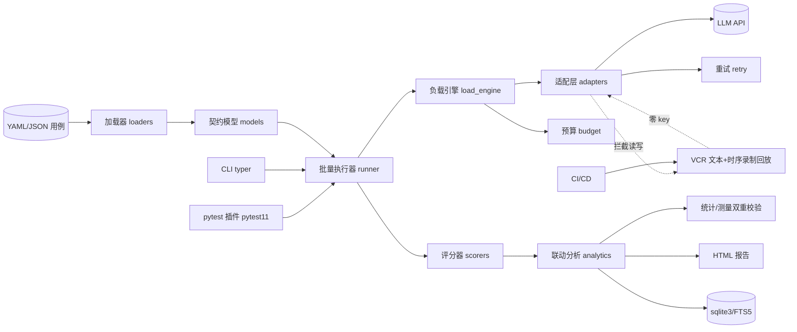
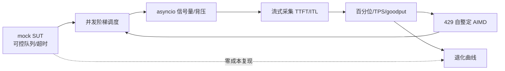
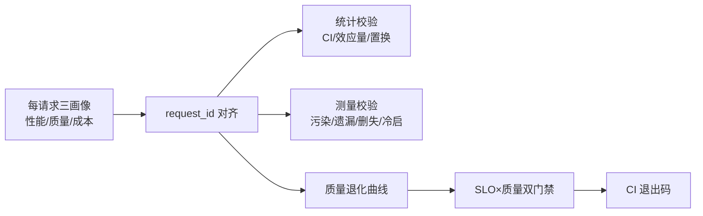
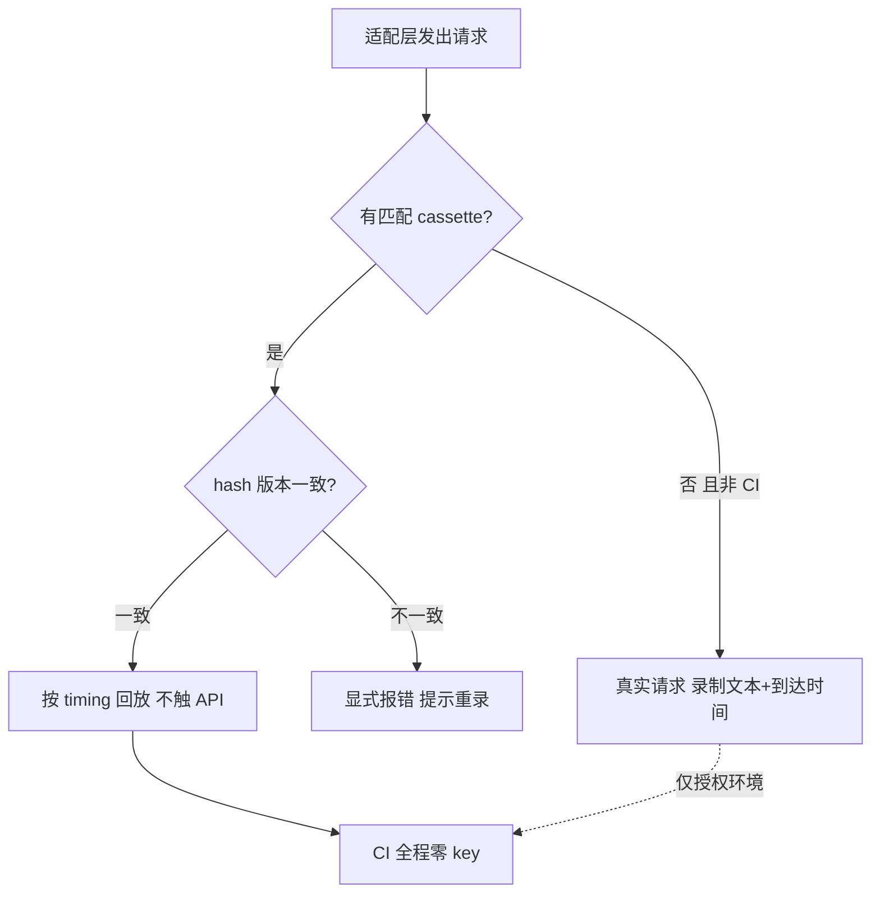
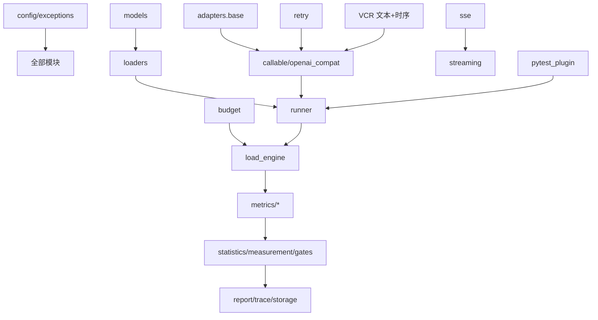

# AquaMind 项目开发计划 v1.0（94 天连续执行 · 证据脊梁版）

> 生效日期：2026-09-28；**AM-Day1 = 2026-09-29，AM-Day94 = 2026-12-31**。
> 本文件是执行的**唯一追踪依据**，只记录工程内容：定位、选型、架构、模块、里程碑、ADR 索引、变更记录。
> **私有文档**：本文件不对外公开，公开路线图见 [`ROADMAP.md`](./ROADMAP.md)。
> **分发策略（2026-10-09 修订）**：维护 PyPI 包。0.0.4 占位版已发布且保持可安装；文档安装命令统一为 `pip install aquamind`；v1.0 于 AM-Day94 通过 OIDC Trusted Publishing 正式发布。GitHub Release 仍作为预发布（rc）与构建产物附件的载体。
> 开发方式：工程化协作，94 天连续执行，每天一个可独立交付、可检验的小模块，周末不跳过。

## 项目定位

AquaMind 是**功能质量 + 非功能质量一体化的 LLM 应用测试工具**（库/CLI 形态，不做账号体系与协作平台）：

- 功能质量：精确匹配评分 + LLM-as-Judge（结构化 rubric），覆盖单轮/多轮/工具调用；
- 非功能旗舰：**负载下的质量退化测试**——并发阶梯负载下，延迟、质量、成本三条曲线联合分析与双门禁判定；
- 差异化边界（2026-09 核实）：**并发阶梯实验设计 + 退化统计与测量双重校验 + 时序保真 cassette + 校准夹具**；
- 明确非目标：红队攻击库不进产品代码（OWASP 检测笔记列入 2027Q1 维护期）、不做语义嵌入评分、不做多租户 SaaS、不绑定单一模型厂商。

## 工时口径（2026-10-09 重排）

| 里程碑 | Day 范围 | 日期 | 天数 | 核心内容 |
|---|---|---|---|---|
| M1 底座 | Day1-18 | 09-29 ~ 10-16 | 18 | 多模型适配层 + SSE 流式采集骨架 + CLI + CI 门禁 |
| M2 功能基线 | Day19-32 | 10-17 ~ 10-30 | 14 | 评分器 + 用例管理 + 批量执行 + 质量基线 |
| M3 负载引擎 | Day33-52 | 10-31 ~ 11-19 | 20 | 负载模型 + 性能指标 + 限流自适应 + 参数矩阵 + 预算 reserve/settle |
| M4 联动分析 | Day53-76 | 11-20 ~ 12-13 | 24 | 统计内核 + 测量有效性 + 质量×性能联动 + 退化曲线 + 双门禁 + 主终点声明 |
| M5 持久化与 SUT | Day77-86 | 12-14 ~ 12-23 | 10 | SQLite 历史 + 对比 + 验证用 SUT + 真实端点观测 + compare |
| M6 打磨交付 | Day87-94 | 12-24 ~ 12-31 | 8 | 覆盖率 ≥90% + 中文文档 + ADR + rc1 + v1.0 PyPI 发布 |
| **合计** | Day1-94 | 09-29 ~ 12-31 | **94** | — |

**机动日**（各归其段，不跨期挪用）：D48（M3）/ D76（M4）/ D83（M5 观测前缓冲）/ D94（M6 验收与全局机动）。
**休息日**（硬约束）：Day38（11-05）/ Day52（11-19）/ Day73（12-10）；当日无开发任务，原任务就近并入相邻日，工时由各里程碑内部余量吸收（M4 现有 3 天内部余量可用）。

**分阶段入账模型**（替代算术证明）：

| 阶段 | 触发点 | 机动日入账 | 可腾挪 | 净需求 | 状态 |
|---|---|---|---|---|---|
| 初始基准 | Day0（不把任何机动日当现金） | 0（纯砍除 7.0） | 7.0 | 8.55 | **缺口 1.55 天** |
| T1 后 | **Day46** 确认 M3 按期 | D48 的 1.0 入账 | 8.0 | 8.55 | **缺口 0.55 天** |
| T2 后 | Day76 确认 M4 按期 | D76 的 1.0 入账 | 9.0 | 8.55 | **盈余 0.45 天** |

> 净需求 8.55 天 = P0 合计 9.25 天 − #10 拆分与 Day11 修复合并的增量差 0.4 天 − 有效共用节省 0.3 天。
> 有效共用：#1 CI 门禁 × #2 cassette 脱敏共用一次 CI 实现 −0.1 天；#3 人话层 × #8 compare 共用 summary 渲染层 −0.2 天。
> **零/负盈余意味着任何延期都必须从砍除项或机动日再挖**——备选 B 方案必须留着。

---

## 砍除项登记与天数去向（合计释放 7.0 天）

> 依据《最终加强点清单 v3.7》第六节。M4 验收（Day76）须核对下列项未被复活。

| 砍除项 | 释放 | 原落点 | 去向 |
|---|---|---|---|
| OptStop 序贯停止 | 1.0 天 | M4-S5 段 | → P0#4 BCa 性能 0.75 + P0#5 统计验证 0.25 |
| BH 多重比较 | 0.5 天 | M4-S4 段 | → P0#3 人话层 0.5 |
| N≥50 渐近分支 | 0.5 天 | M4-S4 段 | → P0#3 人话层 0.5 |
| 最小 RAG demo SUT | 1.0 天 | Day81 | → P0#5 统计验证 1.0 |
| OTel GenAI 导出 | 1.5 天 | Day57-58 | → P0#1 CI 门禁 0.9 + P0#2 cassette 脱敏 0.6 |
| HTML 报告交互/主题 | 0.5 天 | Day68 | → P0#2 剩余 0.4 + P0#9 预算修复 0.1 |
| 持久化趋势线独立模块 | 1.0 天 | Day80 | → P0#6 并发竞态测试 1.0 |
| 插件 P3 报告选项/高级特性 | 0.5 天 | Day88 | → P0#7 主终点声明 0.25 + P0#3 人话层 0.25（**保留退出码接线**） |
| 竞品对标实验 | 0.5 天 | 原 Day47 区段 | → P0#8 compare 0.5；**对照实验本身移 2027-01** |

---

## 全周期每日模块总览（Day1-Day94）

**用法**：每天按日期查 AM-Day N 与对应任务。类型：开发 / 联调 / 集成 / 博客 / 机动。
标记：★核心差异化（必须做透）／○工程达标（及格即可）／🔴休息日／**【已砍除】**／**【P0-n】**= 加强点清单 P0 项。

| Day | 日期 | 类型 | 模块 | 任务 | 里程碑 | 工时 | 标记 |
|---|---|---|---|---|---|---|---|
| 1 | 09-29 | 开发 | M1-D01 | 配置与异常体系 | M1 底座 | 1.0 | ★ |
| 2 | 09-30 | 开发 | M1-D02 | 用例契约模型 | M1 底座 | 1.0 | ★ |
| 3 | 10-01 | 开发 | M1-D03 | YAML/JSON 双加载器 | M1 底座 | 1.0 | ○ |
| 4 | 10-02 | 开发 | M1-D04 | 适配基类 + Callable 适配 | M1 底座 | 1.0 | ★ |
| 5 | 10-03 | 开发 | M1-D05 | OpenAI 兼容适配·非流式 | M1 底座 | 1.0 | ★ |
| 6 | 10-04 | 开发 | M1-D06a | VCR 文本录制·hash 版本 | M1 底座 | 1.0 | ★ |
| 7 | 10-05 | 开发 | M1-D06b | chunk 到达时间录制（timing） | M1 底座 | 1.0 | ★ |
| 8 | 10-06 | 开发 | M1-D06c | 时序调度回放（加速/减速） | M1 底座 | 1.0 | ★ |
| 9 | 10-07 | 开发 | M1-D07 | 重试退避与错误分类 | M1 底座 | 1.0 | ○ |
| 10 | 10-08 | 开发 | M1-D08 | 预算熔断（consume 记账原语） | M1 底座 | 1.0 | ★ |
| 11 | 10-09 | 开发 | **P0-10/11** | Day11 全仓口径修复 + ROADMAP 拆分 + gitignore 兜底 + 扫描脚本 | M1 底座 | 0.5 | ★已完成文件修改，git操作待执行 |
| 12 | 10-10 | 开发 | M1-D09 | SSE 帧解析器（四方言 + 心跳 + 注释 + 截断容错） | M1 底座 | 1.0 | ★ |
| 13 | 10-11 | 开发 | M1-D10 | 流式采集骨架 + 五时间戳契约 | M1 底座 | 1.0 | ★ |
| 14 | 10-12 | 开发 | M1-D11 | OpenAI 流式适配器（Chat Completions 完整 + Responses 骨架） | M1 底座 | 1.0 | ○ |
| 15 | 10-13 | 开发 | M1-D12 | CLI `run` 骨架 + 流式输出接线 | M1 底座 | 1.0 | ○ |
| 16 | 10-14 | 开发 | M1-D13 | 回放接线 + cassette 格式定义；启动 PyPI 发布准备 | M1 底座 | 1.0 | ○ |
| 17 | 10-15 | 开发 | **P0-2** | cassette 录制期脱敏 + 密钥零泄漏测试 + gitignore 兜底 + 扫描脚本落地；PyPI 发布准备完成 | M1 底座 | 1.0 | ★ |
| 18 | 10-16 | 集成 | M1-D14 | **P0-1** CI 覆盖率门禁（全仓≥90% + 三核心 100%）+ 移除 exit-5 容忍 + 零收集断言；M1 验收 | M1 底座 | 1.0 | ★ |
| 19 | 10-17 | 开发 | M2-D01 | 数据契约模型 Score / ScoreTrace | M2 功能基线 | 1.0 | ★ |
| 20 | 10-18 | 开发 | M2-D02 | 测试集格式（jsonl/yaml）+ 数据集校验器 | M2 功能基线 | 1.0 | ○ |
| 21 | 10-19 | 开发 | M2-D03 | 精确匹配评分器（正则 / 包含 / 排除） | M2 功能基线 | 1.0 | ○ |
| 22 | 10-20 | 开发 | M2-D04 | JSON 可解析校验 + 结构化断言 | M2 功能基线 | 1.0 | ○ |
| 23 | 10-21 | 开发 | M2-D05 | 结构化 rubric 评分 + 字段级权重 | M2 功能基线 | 1.0 | ★ |
| 24 | 10-22 | 开发 | M2-D06 | rubric 聚合与归一化 | M2 功能基线 | 1.0 | ○ |
| 25 | 10-23 | 开发 | M2-D07 | Judge 适配器（强制异族 + 结构化 JSON 输出） | M2 功能基线 | 1.0 | ★ |
| 26 | 10-24 | 开发 | M2-D08 | Judge 解析容错 + 降级策略 | M2 功能基线 | 1.0 | ○ |
| 27 | 10-25 | 开发 | M2-D09 | Judge 偏差控制（位置交换 / 冗长归一）+ mock judge 替身 | M2 功能基线 | 1.0 | ○ |
| 28 | 10-26 | 开发 | M2-D10 | Judge 多次投票聚合 | M2 功能基线 | 1.0 | ○ |
| 29 | 10-27 | 开发 | M2-D11 | 评分器注册机制 + 配置化 | M2 功能基线 | 1.0 | ○ |
| 30 | 10-28 | 开发 | M2-D12 | 离线评分批处理 + 分数落库 | M2 功能基线 | 1.0 | ○ |
| 31 | 10-29 | 开发 | M2-D13 | Judge 一致性实验（双评 / κ）+ 人工校准集 | M2 功能基线 | 1.0 | ★ |
| 32 | 10-30 | 集成 | M2-D14 | M2 验收：10 用例端到端 + README 能力清单 | M2 功能基线 | 1.0 | ★ |
| 33 | 10-31 | 开发 | M3-D01a | mock SUT 核心 + 可控队列 / 超时 | M3 负载引擎 | 1.0 | ★ |
| 34 | 11-01 | 开发 | M3-D01b | seed 派生 RNG + 可复现性验收（双跑逐字节一致） | M3 负载引擎 | 1.0 | ★ |
| 35 | 11-02 | 开发 | M3-D02a | `DegradationFn` 接口 + `LevelContext` | M3 负载引擎 | 1.0 | ★ |
| 36 | 11-03 | 开发 | M3-D02b | 曲线形状库（linear/knee/plateau/step/oscillate/saturating） | M3 负载引擎 | 1.0 | ★ |
| 37 | 11-04 | 开发 | M3-D02c | 对照形状 identity / noisy（假阳性素材） | M3 负载引擎 | 1.0 | ★ |
| 38 | 11-05 | 休息 | — | 🔴 休息日（原 M3-D03a 故障形态任务并入 Day39） | M3 负载引擎 | — | 🔴休息日 |
| 39 | 11-06 | 开发 | M3-D03a+b | 故障形态合并（原 D03a+D03b）：流式截断 / JSON 破损 / 429+Retry-After / 5xx / 挂起超时 / 重复 chunk | M3 负载引擎 | 1.0 | ★ |
| 40 | 11-07 | 开发 | M3-D04 | mock SUT HTTP 服务（ASGITransport + `--serve`） | M3 负载引擎 | 1.0 | ★ |
| 41 | 11-08 | 开发 | M3-D05 | 调度时钟 + 五时间戳契约落到负载引擎 | M3 负载引擎 | 1.0 | ★ |
| 42 | 11-09 | 开发 | M3-D06 | 恒定到达率调度器（heap，绝对时刻对齐，不累积误差） | M3 负载引擎 | 1.0 | ★ |
| 43 | 11-10 | 开发 | **P0-9** | 预算 reserve/settle 两段式接口 + docstring 重写 + 在途超支上界测试 | M3 负载引擎 | 0.75 | ★ |
| 44 | 11-11 | 开发 | M3-D07 | Poisson 到达率 + 阶梯 profile + 档间排空 | M3 负载引擎 | 1.0 | ○ |
| 45 | 11-12 | 开发 | M3-D08 | 背压 / 积压记账 + dispatch lag 记录 | M3 负载引擎 | 1.0 | ○ |
| 46 | 11-13 | 开发 | M3-D09 + **M3-D14** | loop-lag 监测（压缩至 0.5 天）+ **S1-S8 预注册冻结（0.5 天）**：全部超参与阈值 + 方法降级链（BCa→Beta-二项/Clopper-Pearson→只报点估计+INCONCLUSIVE）+ 采集协议（五时间戳字段、截尾/超时/错误分类规则、每档预热次数、冷启动标记位）冻结进 gate_config.yaml，哈希覆盖 gate_config.yaml + pricing.yaml 两份并入库（**必须早于 Day47 live，看到任何真实数据之前**） | M3 负载引擎 | 0.5 + 0.5 | ★ |
| 47 | 11-14 | 开发 | M3-D10 | **真实端点探针（全项目唯一一次 live）**：discard 探活 + 10 分钟空载容量标定 + 3 档×1 次 live（判方向） | M3 负载引擎 | 1.0 | ★ |
| 48 | 11-15 | 机动 | M3-FLX | M3 机动（延期吸收；**T1 触发线已前移至 Day46**） | M3 负载引擎 | 1.0 | 机动 |
| 49 | 11-16 | 开发 | M3-D11 | 退化曲线 v1（真实数据→曲线）+ 质量门控 goodput + mock 标定（原 Day51-D12 并入：剂量-反应 + 零注入假阳性 + 错形状负例） | M3 负载引擎 | 1.0 | ★ |
| 50 | 11-17 | 开发 | **P0-6** | 并发竞态测试：PR 子集×3 + 3 个 sleep(0) 时序注入 + 取消孤儿断言 | M3 负载引擎 | 1.0 | ★ |
| 51 | 11-18 | 集成 | M3-D13 | M3 验收：曲线 3 次复测拐点一致 ≤5% + load_engine.py 100%（由 Day52 前移） | M3 负载引擎 | 1.0 | ★ |
| 52 | 11-19 | 休息 | — | 🔴 休息日（原 M3-D13 验收前移至 Day51） | M3 负载引擎 | — | 🔴休息日 |
| 53 | 11-20 | 开发 | M4-S1 | 配对 BCa bootstrap + block bootstrap（单位=运行轮次） | M4 联动分析 | 1.0 | ★ |
| 54 | 11-21 | 开发 | M4-S1b | 空对照自检（双侧二项检验 + replicates≥200 + 上尾阻断） | M4 联动分析 | 1.0 | ★ |
| 55 | 11-22 | 开发 | M4-S2a | 噪声三分解（全方差定律：prediction / data / total） | M4 联动分析 | 1.0 | ★ |
| 56 | 11-23 | 开发 | M4-S2b | judge 层 κ 标定（人工校准集 + κ 置信区间） | M4 联动分析 | 1.0 | ★ |
| 57 | 11-24 | 开发 | M4-S3 | 效应量（d_z / Cliff's delta）+ MDE 与 required_n 互逆对 | M4 联动分析 | 1.0 | ★ |
| 58 | 11-25 | 开发 | M4-S4 | 配对置换检验 + Jonckheere-Terpstra 趋势检验 + Holm 校正 | M4 联动分析 | 1.0 | ★ |
| 59 | 11-26 | 开发 | **P0-5a** | 新建 `tests/test_stats_reference.py` + dev extras 加 numpy/scipy/statsmodels + 5 个已知分布解析解用例 | M4 联动分析 | 1.0 | ★ |
| 60 | 11-27 | 开发 | **P0-5b** | 蒙特卡洛覆盖率回归进 CI（固定种子小批量；完整版进发版级校准） | M4 联动分析 | 0.5 | ★ |
| 61 | 11-28 | 开发 | **P0-5c** | meta-validation：人为饱和客户端→必报 UNVERIFIABLE；注入符号 bug→空对照上尾报警 | M4 联动分析 | 0.5 | ★ |
| 62 | 11-29 | 开发 | **P0-4** | BCa 性能：预注册 n→n_boot 匹配表 + 算法级降本（quickselect / array('d')） | M4 联动分析 | 0.75 | ★ |
| 63 | 11-30 | 开发 | **P0-4** | 双路径基准（大 n 延迟分位数 <10s + 空对照 200 次 <10min）+ nightly 性能门 | M4 联动分析 | 0.25 | ★ |
| 64 | 12-01 | 开发 | M4-S5 | loop-lag 自校准 + 有效并发包络 + 逐维度可信度声明 | M4 联动分析 | 1.0 | ★ |
| 65 | 12-02 | 开发 | M4-S6 | 协调遗漏报告（scheduled / dispatched / sent 三时间戳） | M4 联动分析 | 1.0 | ★ |
| 66 | 12-03 | 开发 | M4-S7 | 截尾分离统计（complete / truncated / timeout / error 四组） | M4 联动分析 | 1.0 | ★ |
| 67 | 12-04 | 开发 | M4-S8 | 冷启动分离 + 预热协议（until_stable） | M4 联动分析 | 1.0 | ★ |
| 68 | 12-05 | 开发 | **P0-7** | 主终点声明 `primary_endpoint: quality` + 四终点 FWER≈18.5% 写入 ADR-0003 | M4 联动分析 | 0.5 | ★ |
| 69 | 12-06 | 开发 | M4-D06 | 五态四码门禁状态机 + 退出码接线（**0←PASS/STABLE；1←FAIL；2←WARN；3←INCONCLUSIVE，含 UNVERIFIABLE / TOOL_ERROR 原因码族**） | M4 联动分析 | 1.0 | ★ |
| 70 | 12-07 | 开发 | **P0-3a** | 报告三行人话层（2 个高频码完整文案 + 9 个一句话）+ `report.summary.v1` JSON | M4 联动分析 | 0.75 | ★ |
| 71 | 12-08 | 开发 | **P0-3b** | 11 码映射表全量 + `INCONCLUSIVE_UNDERPOWERED`→`required_n()` 现算 | M4 联动分析 | 0.5 | ★ |
| 72 | 12-09 | 开发 | M4-D09a+b | 退化曲线图 + 置信区间带 + 阶梯对比图 + 测量有效性面板（原 Day73-D09b 并入：延迟维度 / 质量维度可信度分离展示） | M4 联动分析 | 1.0 | ★ |
| 73 | 12-10 | 休息 | — | 🔴 休息日（原 M4-D09b 测量有效性面板并入 Day72） | M4 联动分析 | — | 🔴休息日 |
| 74 | 12-11 | 开发 | M4-D07 | JUnit XML 输出 + CLI `gate` / `report` / `calibrate` 子命令 | M4 联动分析 | 1.0 | ○ |
| 75 | 12-12 | 集成 | M4-D10 | 端到端黄金场景（mock 全曲线套件）+ 变异 / 边界压测 | M4 联动分析 | 1.0 | ★ |
| 76 | 12-13 | 机动 | **P0-11** | **T2 触发线检查**（P0 完成度<80%→立即执行 B 方案）；M4 验收 + **砍除项未复活核对** | M4 联动分析 | 1.0 | 机动 |
| 77 | 12-14 | 开发 | M5-D01 | sqlite schema / 仓储（含 FTS5）+ 三层数据源标注 | M5 持久化与 SUT | 1.0 | ○ |
| 78 | 12-15 | 开发 | M5-D02 | 运行历史落库 | M5 持久化与 SUT | 1.0 | ○ |
| 79 | 12-16 | 开发 | M5-D03 | 两次运行版本对比（diff + CI / 效应量 diff） | M5 持久化与 SUT | 1.0 | ○ |
| 80 | 12-17 | 开发 | **P0-8** | `aquamind compare`（**强制 case_id 集合一致，不一致直接拒绝**）+ 基线 pin 文件 | M5 持久化与 SUT | 0.5 | ★ |
| 81 | 12-18 | 开发 | M5-D05 | 真实端点观测协议（预算 / 档位 / 预热 / 三层数据源；**live 已于 Day47 完成，本日仅整理协议与授权检查**） | M5 持久化与 SUT | 1.0 | ★ |
| 82 | 12-19 | 开发 | M5-D06 | cassette 录制脱敏 + 分区入库 | M5 持久化与 SUT | 1.0 | ○ |
| 83 | 12-20 | 机动 | — | M5 观测前缓冲机动日 | M5 持久化与 SUT | 1.0 | 机动 |
| 84 | 12-21 | 开发 | M5-D07 | **cassette 时序回放复核（一）**：Day47 的 real-live cassette 三层数据源分区复算（**零 API 调用；live 已于 Day47 完成，本日不打 live**） | M5 持久化与 SUT | 1.0 | ★ |
| 85 | 12-22 | 开发 | M5-D08 | **回放复核（二，承接 Day84）**：回放机制复核（**不进统计功效**）+ 真实 vs 回放统计口径对比 + 冷启动标注 | M5 持久化与 SUT | 1.0 | ★ |
| 86 | 12-23 | 集成 | M5-D09 | M5 验收：量化数字包 + 校准夹具 v0 + 检测器灵敏度总报告 | M5 持久化与 SUT | 1.0 | ★ |
| 87 | 12-24 | 开发 | M6-P1 | pytest 插件 P1（pytest11 入口 + marker + fixture） | M6 打磨交付 | 1.0 | ★ |
| 88 | 12-25 | 开发 | M6-P2 | pytest 插件 P2（**退出码接线，保留不砍**：0←PASS/STABLE；1←FAIL；2←WARN；3←INCONCLUSIVE）+ 异步事件循环隔离 | M6 打磨交付 | 1.0 | ★ |
| 89 | 12-26 | 开发 | M6-D01 | AST 分层断言 + HTML 报告 XSS 转义三条路径 + `tests/test_guardrails.py` | M6 打磨交付 | 1.0 | ○ |
| 90 | 12-27 | 开发 | M6-D02 | 中文文档与 API 参考 + ADR 补齐（开环 / 配对 / 单进程 / 主终点） | M6 打磨交付 | 1.0 | ○ |
| 91 | 12-28 | 博客 | M6-D03 | **T3 触发线** + rc1 预发布（GitHub Release pre-release）+ 发布前扫描 | M6 打磨交付 | 1.0 | ★ |
| 92 | 12-29 | 开发 | M6-D04 | README 打磨 + 示例库 + 技术博客《你看到的质量变化有多少是真的》 | M6 打磨交付 | 1.0 | ○ |
| 93 | 12-30 | 开发 | M6-D05 | v1.0 正式构建 + `python -m build` + `twine check` + 干净 venv 安装冒烟 | M6 打磨交付 | 1.0 | ★ |
| 94 | 12-31 | 机动 | M6-D06 | **v1.0 PyPI 发布**（OIDC Trusted Publishing）+ M6 验收 + 全局复盘 | M6 打磨交付 | 1.0 | ★ |

> **【已砍除】标记**：本表已不含 OTel GenAI 导出、HTML 报告交互、持久化趋势线独立模块、RAG demo SUT、
> 插件 P3 报告选项与高级特性、OptStop、BH、N≥50 渐近分支。释放天数去向见「砍除项登记」表。

---

## 全局强制规则

1. **VCR 文本录制回放（含时序）**：cassette 同时录制请求/响应 JSON、**hash 版本字段**与 **chunk 到达时间（timing）**；回放优先；支持加速/减速倍率；hash 不匹配显式报错；兼容无时序旧格式（按瞬时回放）。
2. **CI 零 key**：所有 CI 任务只走 mock SUT + 回放（含时序回放），不触真实 API。
3. **真实端点（只打一次）**：**仅 Day47（2026-11-14）**做一次 live 观测，限 **3 档 × 1 次**，预热后测、放空闲时段；数据按三层数据源标注（**mock 受控 / real-live 真实直录 / real-replay 真实时序回放**）分区入库。**M5 不再打 live**：Day84 只做 cassette 时序回放复核（零 API 调用）+ 真实 vs 回放对比。
4. **mock SUT**：M3 第一天交付（2026-10-25），可控队列/超时，零成本稳定复现退化曲线。
5. **Agent 轻量（≤12h）**：多轮 messages + 工具调用期望；断言按 **参数 > 顺序 > 工具** 组织。
6. **M5 瘦身**：检索用 sqlite FTS5（不手写 BM25 公式、不引入 Chroma，Chroma 列 backlog）。**RAG demo 已砍除**，仅保留文档 20 行示例（省 1.0 天 → P0#5 统计验证）。
7. **深度模块"三个一"**：一组量化数字（必须带**置信区间**并通过**测量有效性**校验）+ 一篇方法论博客（掘金/知乎）+ 一个可演示产物。
8. **统计 + 测量双重校验**：旗舰结论必须同时给出点估计、置信区间、效应量，并排除 GIL 测量污染、协调遗漏、删失偏差、冷启动四类伪源；仅描述性数字不构成结论。
9. **覆盖率门禁（单一口径）**：**自 D18 起 CI 硬门禁"全仓 ≥90%"**；三核心模块（statistics / measurement_validity / load_engine）**文件存在即 100%**，不存在则 skip 并记录（**M4 验收加断言"三文件必须已存在"**）。各里程碑验收日一律按此口径核对。
10. **pytest 插件优先**：采纳顺序 plugin > CLI > library；用户不改动现有测试即可使用。
11. 工具库（httpx/pydantic/typer）只做到**会用**，不做深。
12. OWASP 检测笔记列入 **2027Q1 维护期**，不占开发工时。

---

# 第 0 章：架构与原理图

## 0.1 系统架构图



## 0.2 图 A：负载引擎工作原理



## 0.3 图 B：双重校验与双门禁原理



## 0.4 图 C：VCR 时序保真与 CI 零 key 原理



## 0.5 模块依赖图



---

# M1 底座（AM-Day1~18，2026-09-29 ~ 2026-10-16）

> 验收（AM-Day16）：适配器切换 2 端点（含本地 mock）；429/超时分类单测通过；CLI 退出码正确；时序回放可复跑；**覆盖率 ≥90%（当前实际 100%，本门禁用于防回退）+ 三核心三文件存在即 100%**。

### M1-D01｜配置与异常体系（AM-Day1，2026-09-29）✅
- **文件**：`src/aquamind/config.py`、`src/aquamind/exceptions.py`
- **类/函数**：
  - `load_config()`：pydantic-settings 读 `AQ_` 前缀环境变量，含默认值（模块级函数，非 `Settings` 的方法）
  - `AquaMindError.__init__(message, context: dict)`：异常基类
  - 子类：`ConfigError` `LoaderError` `AdapterError` `ReplayError` `BudgetError`
- **测试**（tests/test_config.py、test_exceptions.py）：缺省值；环境变量覆盖；非法值拒绝；异常携带 context
- **检验**：缺省配置可用；坏值被拒

### M1-D02｜用例契约模型（AM-Day2，2026-09-30）✅
- **文件**：`models/testcase.py`、`models/__init__.py`
- **类/函数**：`TestCase`（input/context/expected/score_tags/weights）；`ExpectedSpec`；`ScoreTag`
- **测试**：合法最小用例；缺必填被拒且定位字段；权重非负
- **检验**：坏数据报错指向具体字段

### M1-D03｜YAML/JSON 双加载器（AM-Day3，2026-10-01）✅
- **文件**：`src/aquamind/loaders.py`
- **函数**：`load_cases(path) -> list[TestCase]`；`_parse_yaml/_parse_json`；`_report_error(file, line, msg)`
- **测试**：双格式正常；坏 YAML 报行列号；空文件异常
- **检验**：坏文件报错含行列号

### M1-D04｜适配基类 + Callable 适配（AM-Day4，2026-10-02）✅
- **文件**：`adapters/base.py`、`adapters/callable.py`、`adapters/__init__.py`
- **类/函数**：`BaseAdapter.acomplete(messages, stream=False)`（抽象）；`CallableAdapter(fn)`
- **测试**：本地函数调用；抽象类不可实例化；返回结构归一
- **检验**：本地函数跑通一次调用

### M1-D05｜OpenAI 兼容适配·非流式（AM-Day5，2026-10-03）✅
- **文件**：`adapters/openai_compat.py`
- **类/函数**：`OpenAICompatAdapter(base_url, api_key, model, timeout)`；`acomplete()`；`_normalize_response()`
- **测试**：mock server 成功路径；401/500 分类异常；超时
- **检验**：mock 下单测通过，不触真实 API

### 覆盖率提升 92%→100%（AM-Day5 附加，2026-10-03）✅
- **commit**：`05aa741`（第 17 次提交），仅加测试，`src/` 零改动
- **补测**：`base.py:61` 基类兜底 NotImplementedError；`cli.py:12-47` typer 骨架入口
  （含 `__main__` 分支）；`config.py:108` log_level 校验器非 str 透传；
  `loaders.py:55-56,128,131` 目录读取/顶层非数组/元素非 mapping
- **结果**：234 stmts / 0 miss / 38 branch / 0 partial = **100%**；测试 118 → 141
- **踩坑**：① coverage 只统计当前进程，CLI 的 `app()` 必须用 `runpy.run_path` 就地以
  `__main__` 身份执行，subprocess 永远盖不到那一行；② `typer 0.27` 把 click 内置为
  `typer._click`，测试只能用 `typer.testing.CliRunner`，不可 `import click`；
  ③ 读目录在 Windows 抛 `PermissionError`、POSIX 抛 `IsADirectoryError`，
  该错误映射需定向构造才能双平台覆盖
- **CI**：ubuntu-latest / windows-latest 双 job 全绿

### 代码审查与 P1 修复（AM-Day5 附加，2026-10-03）✅
- **审查**：`docs/bug_audit_report_aquamind_20261002.md`，17 条缺陷（P0×0 / P1×3 / P2×7 / P3×7），
  结论「有条件通过」；每条 P1 均在 `%TEMP%` 内脚本实证复现，未改动仓库任何源码
- **修复 commit**：`db8a023`（第 18 次提交），只动 `loaders.py` + `adapters/openai.py`
  - **P1-1** 非 UTF-8 用例文件：`read_text(encoding="utf-8")` 抛 `UnicodeDecodeError`
    （非 OSError，原 except 链漏网）→ 包装为 `LoaderError`，`context["encoding"]="utf-8"`
  - **P1-2** 非法 `base_url`：`httpx.InvalidURL` 直接继承 `Exception` 而非 `HTTPError`，
    绕过 `except httpx.HTTPError` 逃逸出 `AdapterError` → 双层修复：`__init__` 校验
    非空 + http/https 前缀（构造期早失败）+ except 元组加宽为
    `(HTTPError, InvalidURL, ValueError)`
  - **P1-3** HTTP 错误消息拼接响应体：网关回显请求体时用户 prompt 全量进入日志 →
    消息只留状态码 + 响应体长度，响应体片段移入 `context["response_body"]`
- **结果**：测试 141 → 154（+13），240 stmts / 0 miss / 40 branch / 0 partial = **100%**
- **变异验证**：四处逐一撤销修复并确认对应用例变红（UnicodeDecodeError 捕获 3 红、
  构造期校验 5 红、except 收窄 1 红、消息脱敏 2 红），恢复后全绿
- **踩坑**：① `AquaMindError.__str__` 会渲染 `context` 的**全部取值**，故响应体移入
  context 后仍会出现在 `str(exc)` 里——P1-3 只解决了「消息字段」层面的泄露，
  彻底消除需改 `exceptions.py` 脱敏（另立任务，本次禁改范围外）；
  ② 该机制也正好让既有测试 `body[:500] in str(e)` 无需修改即通过，避免了
  「修复代码必须改既有测试」的硬边界冲突；③ `len(response.text)` 是**字符数**
  不是字节数（中文 6 字符 = 18 字节），故消息用「字符」而非「字节」
- **CI**：ubuntu-latest / windows-latest 双 job 全绿
- **待办**：P2×7 / P3×7 见审查报告，建议 M2 之前优先处理事件循环阻塞（V1-P2-5）
  与 `.env` 依赖 CWD（V1-P2-4）

### P2 批量修复 + 异常基类脱敏（AM-Day5 附加，2026-10-03）✅
- **commit**：`a4c7ae7`（第 19 次提交），5 源码 + 5 测试文件
- **修复项 0（架构级）**：`AquaMindError.__str__` 只渲染 message + context **键名**，
  不再渲染取值 → `context["response_body"]` 等敏感内容不再进入 str(exc) / traceback /
  logging.exception；取值一律经 `exc.context["key"]` 显式读取。P1-3 的「已知残留」至此闭环
- **7 个 P2**：
  - V1-P2-1 `loaders.py` 非字符串键 → 展开前校验，报「第 N 条用例包含非字符串键」而非裸 `TypeError`
  - V1-P2-2 `openai.py` choices 四类根因（缺失 / null / 类型错 / 空列表）分别措辞 + `present`/`actual_type`
  - V1-P2-3 `openai.py` metadata 增 `latency_includes_connection=True` 显式标识端到端口径
    （第二步「连接复用」留待 M3 前，文档已声明不可当作服务端耗时）
  - V1-P2-4 `config.py` docstring 声明 `.env` 按 CWD 解析（不改默认行为，避免破坏既有用法）
  - V1-P2-5 `callable.py` 同步 fn 经 `asyncio.to_thread` 卸载，并顺带覆盖 P3-1 的 async fn 检测
  - V1-P2-6 `openai.py` choices[0] 非对象报「不是对象」，与「缺少 message」分成两类
  - V1-P2-7 `loaders.py` 读文件改 `utf-8-sig`，YAML/JSON 的 BOM 行为一致
- **结果**：测试 154 → 180（+26），259 stmts / 0 miss / 54 branch / 0 partial = **100%**
- **同步修正的既有测试（3 处，均为契约变更倒逼，非放宽）**：
  ① `test_str_with_context`：`key=value` → 断言键名（脱敏语义反转）
  ② `test_returns_normalized_response`：metadata 键集补 `latency_includes_connection`
  ③ `test_http_error_status_codes_rejected`：`body in str(exc)` → `body in exc.context["response_body"]`
- **变异验证**：`__str__` 重新渲染取值 → 4 红；同步 fn 改回直接调用 → 并发用例实测
  0.401s（串行）> 0.3s 阈值变红，确认计时类断言非空断言
- **踩坑**：① `mypy strict` 含 `--warn-unreachable`，若把解析结果标注为
  `list[dict[str, Any]]`，则 `isinstance(key, str)` 的 False 分支会被判为不可达而报错，
  必须把 `_ensure_case_list` 返回类型放宽为 `list[dict[Any, Any]]`（YAML 键本就可是任意可哈希值）；
  ② 本次未按建议拆 2 个 commit：修复项 0 与 P2 在 `test_openai_adapter.py` 中纠缠，
  拆分后任一中间树都无法保证「单独 checkout 自洽全绿」
- **CI**：ubuntu-latest / windows-latest 双 job 全绿
- **剩余**：P3×7 未处理（含 `context["url"]` 凭据脱敏、`usage` 缺省 None 等）

### M1-D06a/b/c｜VCR 文本 + 时序录制回放（AM-Day6~8，2026-10-04~06）— 深度·三个一 ✅（D6a/D6b/D6c 全部完成）
- **文件**：`src/aquamind/replay.py`
- **三日交付**：
  - D6a：`Cassette`（请求指纹/响应体/**hash 版本字段**）；`record/find_match/play()`
  - D6b：每 **chunk 到达时间录制**，cassette 增加 `timing` 字段
  - D6c：**时序调度回放**（按录下时间调度，支持加速/减速倍率；旧格式瞬时回放）
- **测试**：录制后离线回放一致；无匹配异常；hash 不符报错；时序回放偏差；倍率加速/减速；旧格式兼容
- **三个一**：scripts/replay_baseline.json（回放一致率/时序偏差）；博客素材并入 M4 有效性复盘；examples/replay_demo/（含时序 cassette）
- **决策 ADR**：时序保真回放的设计决策与边界
- **检验**：离线回放文本与时序均可复现；hash 不匹配报错

**D6a 交付明细（2026-10-04）**
- **commit**：`ae15fc4`（第 20 次提交），1 源码 + 1 测试 + 2 产物目录
- **实现**：`Cassette`（请求指纹/响应体/`request_hash` 版本字段）；`record/find_match/play`
  + `replay_request`（无匹配显式报错入口）；`ReplayedResponse`（读取面与
  `httpx.Response` 对齐：status_code/headers/text/content/json）
- **结果**：测试 180 → 219（+39），393 stmts / 0 miss / 76 branch / 0 partial = **100%**
  （`replay.py` 单模块 100%）；`mypy src` 与 `ruff check src tests` 零错误
- **三个一**：`scripts/replay_baseline.json`（8 组场景，status_code/body/text 一致率
  均 100%，平均指纹计算耗时 0.005 ms）；`examples/replay_demo/`（演示 + 基线生成脚本）
- **关键设计**：① 指纹 = 方法+URL+关键请求头+请求体规范化后取 SHA-256 前 16 位，
  头名小写归一（`Content-Type` 与 `content-type` 同指纹）、噪声头不入指纹
  （User-Agent 升级不致 cassette 失效）；② `authorization`/`x-api-key` 参与指纹但
  只以 `sha256:<前16位>` 摘要落盘——cassette 会入库，明文密钥不可接受，且换密钥
  仍能被指纹察觉触发重录；③ 后续 `timing` 字段一律带默认值，旧 cassette 天然
  可加载（D6c「旧格式瞬时回放」即基于此）
- **待续**：D6b（chunk 到达时间录制 + `timing` 字段）、D6c（时序调度回放与
  加速/减速倍率、旧格式兼容）、ADR 统一在 D6c 后补写

**D6a 独立验收热修（2026-10-04）**
- **commit**：`09cd733`（第 21 次提交），5 文件（1 源码 + 1 测试 + 2 脚本 + 1 文档）
- **P2-1 demo 非幂等**：演示脚本原先硬编码写仓库内 `examples/replay_demo/cassettes/`，
  每跑一次就用当前时刻改写被跟踪文件，工作区留下 ` M`、已交付示例与实际内容漂移。
  改为默认写系统临时目录（`%TEMP%\aquamind-demo-*`），并加 `--cassette-dir` 显式指定；
  仓库内示例 cassette 作为静态产物保留
- **P2-2 产物被重跑覆盖**：随 P2-1 一并解决；README 增「交付纪律」条款——
  交付后勿重跑 `generate_baseline.py` 覆盖 `scripts/replay_baseline.json`，
  需重生成请在独立分支/临时目录做后显式提交
- **P3-1 临时目录泄漏**：`generate_baseline.py` 的 `mkdtemp` 改为
  `TemporaryDirectory` 上下文管理器，退出即清理（此前每跑一次在 `%TEMP%` 留一个
  含 8 个 cassette 的目录持续累积）；顺手把报告里 `hash_length: 16` 硬编码改为
  `len(实测指纹)`，消除与 `_HASH_LENGTH` 的双写漂移
- **P3-6 缺格式版本字段**：加 `format_version`（默认 1）+ `CURRENT_FORMAT_VERSION`，
  缺字段按 v1 解析（向后兼容），高于上限报「版本过新，请升级 aquamind」
- **关键设计（版本闸门位置）**：闸口必须放在 pydantic 契约校验**之前**。
  `Cassette` 是 `extra="forbid"`，D6b 加 `timing` 后旧代码读到新文件会先因未知字段
  报「字段不符合契约」——把「代码太旧」说成「文件损坏」，排障方向第一步就错。
  故 `_check_format_version` 在 `model_validate` 之前拦。已用
  `test_version_gate_beats_contract_error` 固定该行为，并实测三种输入的判别：
  `v2+timing`→「版本过新」；`仅 timing 无版本号`→「字段不符合契约」；
  `版本号非整数`→「字段不符合契约」（畸形值交契约层）
- **结果**：测试 219 → 225（+6），404 stmts / 0 miss / 82 branch / 0 partial = **100%**
  （`replay.py` 100%）；`mypy src`、`ruff check src tests examples` 零错误
- **手动验证**：跑完 demo 后 `git status` 无 `M examples/replay_demo/cassettes/`；
  跑完 baseline 后 `%TEMP%` 下 `aquamind-baseline-*` 计数 0（脚本已用
  `git checkout` 恢复受保护产物 `scripts/replay_baseline.json`）

**D6b 交付明细（2026-10-05）**
- **commit**：`e5298a4`（第 22 次提交），6 文件（1 源码 + 1 测试 + 3 示例 + 1 产物 JSON）
- **实现**：`ChunkTiming`（index/arrival_ms/text，`extra="forbid"`）；`Cassette.timing`
  （`list[ChunkTiming] | None = None`，带默认值保向后兼容）；`CURRENT_FORMAT_VERSION`
  1 → 2；`record(..., chunks: list[tuple[float, str]] | None = None)` 增时序录制。
  `find_match()/play()` 逻辑不变——**只录不播**
- **结果**：测试 225 → 240（**15 条新增用例**；另 2 条存量用例的断言随版本号调整），
  414 stmts / 0 miss / 82 branch / 0 partial = **100%**（`replay.py` 155 stmts / 28 branch
  全覆盖）；`mypy src`、`ruff check src tests examples` 零错误
- **三个一**：`scripts/replay_baseline.json`（11 组场景 = 8 非流式 + 3 流式，
  status_code/body/text 一致率均 100%，**时序 3 组共 12 个 chunk**，平均每片 3.92 字，
  首片归零/单调递增/3 位小数/JSON 往返/增量拼接对齐五项精度指标均 100%，
  实测最大小数位 3）；`examples/replay_demo/`（演示脚本增时序分支 `[11]`~`[19]`）
- **关键设计**：① 时刻存**相对偏移**——录制的绝对时刻受发起机器时钟与运行时刻影响，
  既不可复现也无回放价值，`record()` 以第一个 chunk 为原点平移，首片恒 0.0，
  首包延迟不进时序；② `arrival_ms` 保留 3 位（微秒精度），把 `0.1+0.2` 这类浮点
  尾差挡在落盘前，保证同一段流在不同机器上录出相同数字；③ **保序即事实**——
  `index` 即位置，不按 `arrival_ms` 重排，录制顺序才是服务端真实下发顺序，
  故允许 `arrival_ms` 为负（表达「比首片还早到达」），排序会掩盖真实乱序
- **踩坑**：① `format_version` 升 2 后，D6a 存量测试 `test_version_gate_beats_contract_error`
  原本拿 `v2 + timing` 构造「未来 cassette」，此时 v2 已受支持，闸口不再触发、
  该用例会退化成「字段不符合契约」——已改为 `CURRENT_FORMAT_VERSION + 1` + 未来字段名，
  并补 `test_unknown_field_on_supported_version_is_contract_error` 锁死两类根因的边界；
  ② `chunks=[]` 与 `chunks=None` 必须区分：前者是「流式但未采集到 chunk」
  （`timing == []`），后者是「非流式」（`timing is None`），否则 D6c 无法区分
  「旧格式按瞬时回放」与「流式无内容」
- **待续**：D6c（时序调度回放与加速/减速倍率、旧格式兼容）、ADR 统一在 D6c 后补写

**D6c 交付明细（2026-10-06）**
- **commit**：`9770c8f`（第 24 次提交），7 文件（1 源码 + 1 测试 + 3 示例 + 1 产物 JSON + 1 ADR）
- **实现**：`play_timed(cassette, speed=1.0) -> TimedReplay`（产出 chunk 文本的迭代器，
  附 `deviation` 时序偏差统计）；`replay_request_timed()`（查找 + 指纹校验 + 调度，
  与 `replay_request` 同构）；`TimingDeviation`（逐片计划/实际时刻 + 偏差汇总）。
  `play()` / `record()` / `find_match()` 逻辑**一字未动**，不新增 cassette 字段，
  `format_version` 保持 2
- **结果**：测试 241 → 261（**20 条新增用例**，时序相关用例连跑 3 次稳定），
  505 stmts / 0 miss / 98 branch / 0 partial = **100%**（`replay.py` 246 stmts /
  44 branch 全覆盖）；`mypy src`、`ruff check src tests examples scripts` 零错误
- **三个一**：`scripts/replay_baseline.json`（新增 `timing_replay` 段：11 组场景 =
  8 非流式 + 3 流式共 12 个 chunk，三档倍率文本一致率均 **100%**，原速最大偏差
  **0.445ms** / 平均 **0.246ms**，2x 加速 **0.782/0.329ms**，0.5x 减速
  **0.752/0.351ms**，实测/计划耗时比 1.0006~1.0015 即无累积漂移；瞬时回放两种形态
  各产出 1 项、耗时 0.011/0.018ms 且不 sleep；非法倍率 4 种与篡改 hash 均被拦截）；
  `examples/replay_demo/`（演示脚本增调度段 `[20]`~`[28]`，加速 200.3ms / 原速
  400.6ms / 减速 800.6ms）；`docs/adr/0008-timing-replay.md`（三层 ADR）
- **关键设计**：① **生成器而非回调**——流式是一条「等到了才给下一片」的消费链，
  回调要把开始/结束/异常/缓冲全推给调用方，生成器让产出节奏由消费速度牵引；
  ② **两个入口并存而非给 `play()` 挂 `timed` 开关**——开关会让「要不要时序」变成
  可漏传的默认值，同一次回放在不同调用点悄悄给出不同 chunk 边界，而那不会在任何
  日志里留痕，它不是失败，是**没测**；③ **绝对时刻对齐而非逐片 sleep 间隔**——
  后者让第 N 片的误差等于前 N-1 片之和，一次 15ms 抖动被放大到流末（使用方感知
  最敏锐处），前者把误差约束在单次定时器精度内；④ **偏差基准先除 speed**——用
  未折算的 `arrival_ms` 当基准，加速回放会凭空显示整段 `1/speed` 的「偏差」，把
  正确调度报成错误；⑤ **非法倍率显式报错不静默回退**——「回放得慢」与「回放的
  根本不是这段时序」在结果里长得一样
- **踩坑**：① 「speed 极大时退化为不 sleep」最初只判了 `remaining > 0`，结果
  `speed=1000` 下每片仍以 0.025ms 的间隔去调 sleep——**注定无效的系统调用**。
  改为低于 `_MIN_SLEEP_SECONDS`（1ms）直接跳过，但仍**逐片产出**：退化口径必须是
  逐片而非一次性给全，否则打字机/进度条依赖的 chunk 边界会整体变形；
  ② mock 掉 `time.sleep` 后时钟不再推进，`sleep` 参数是**累计的计划时刻**而非
  相邻间隔。这不是 bug 而是绝对对齐的形状（也是它区别于逐片间隔的证据），用例按
  真实语义断言而非按直觉断言
- **ADR**：`docs/adr/0008-timing-replay.md`（决策/备选/边界三层；已按 D6b「ADR 统一
  在 D6c 后补写」的约定把时序保真回放的取舍补齐）
- **待续**：CLI 侧的 `--speed` 与偏差阈值暴露随 M1-D12 集成；时序回放**不得**用于
  论证真实 TTFT 是否达标（见 ADR 0008 边界五）

**D6c-fix 热修明细（2026-10-06）· 独立验收 P3 全修（6 项，已修 6 项，待 1 项授权）**
- **背景**：DeepSeek 独立验收结论「通过（P0=0/P1=0/P2=0/P3=6）」，6 个 P3 全部为
  文档/配置/测试表述层面，无功能缺陷
- **P3-1 恒真冗余断言**：删除 `assert all(call > 0 for call in sleep_calls)`。空列表下
  `all()` 恒为 True，它既不覆盖任何行为，又让人误以为「负 sleep」被单独验证过；紧随
  其后的 `assert sleep_calls == []` 已是更强断言。已就地留注释说明为何不再加回
- **P3-2 E501 启用 + 超长行修复**：`pyproject.toml` 新增 `[tool.ruff.lint]`，
  用 **`extend-select = ["E501"]` 而非 `select`**——`select` 会顶掉 ruff 默认规则集，
  E501 到位的同时 F401 等既有检查会一起失效（已实测：`--select E501` 只报 E501，
  `--extend-select E501` 两者都报）。那是把「加严」做成「放宽」；本项的目的是让
  「行长 100」从声明变成可执行门禁，不能顺带削弱别的检查
- **P3-2 关键发现：ruff 的 E501 按**显示宽度**判定（全角字符记 2 列），与字符数不同**。
  任务书列出的 6 处是按字符数统计的，启用 E501 后实测**另有 2 处**按宽度超限：
  `src/aquamind/models/testcase.py:67`（91 字符 / 宽度 107）与
  `examples/replay_demo/demo_record_play.py:260`（97 字符 / 宽度 101）。两处原属
  当日禁改文件，**经负责人授权后扩入范围**一并修复（纯格式拆分，不改语义）
- **P3-3 指纹校验责任**：`play_timed()` docstring 开头加 ⚠️ 段：本函数**不执行任何
  request_hash 校验**，手工从磁盘加载 cassette 直接调用时指纹不一致**不会被拦截**，
  给出两条正确用法（经 `find_match` / 自行重算比对）；`Raises` 段补「不抛指纹不匹配
  异常，校验由 find_match 负责」
- **P3-4 非数值 speed 防御**：`_validate_speed()` 用 try/except 捕获 `TypeError` 转成
  `ReplayError`（消息含「必须为数值类型」，context 带 `speed_type`），NaN/inf/<=0 的
  既有行为不变。理由：M1-D12 起 speed 来自命令行字符串，类型标注拦不住运行时值，
  而 TypeError 不在模块异常体系内，调用方 `except ReplayError` 会漏掉这一类
- **P3-5 瞬时回放判定改为直接计数**：`generate_baseline.py` 用
  `unittest.mock.patch("time.sleep")` 桩替换 sleep，判据由「耗时 < 50ms 的间接推断」
  改为「sleep 被调用 0 次」；桩的作用域严格限定在 with 块内，不影响三档倍率的真实
  偏差测量；**并加了阳性对照**（同一根桩插到带 timing 的 cassette 上须数到调用），
  否则「0 次」可能只是桩没接上
- **P3-6 actual_ms 时点定义**：docstring 明确 `actual_ms` = **该片被 yield 之前一刻**
  的相对时刻（生产侧准备产出的时刻），消费方收到文本的时刻可能略晚（生成器传递开销
  量级微秒，远低于 3 位小数记录精度），故它是「到达时刻」的上界意义
- **测试**：241→262 中 D6c 的 261 → **262**（新增 1 条 `test_non_numeric_speed_raises_replay_error`，
  覆盖 str/None/list 三种非数值 + context 字段 + 非数值路径不带 request_hash）；
  时序相关用例连跑 3 次稳定
- **质量门禁**：`mypy src` 零错误；覆盖率全仓 **509 stmts / 0 miss / 98 branch /
  0 partial = 100%**（`replay.py` 250 stmts / 44 branch 全覆盖，新增分支已被测试覆盖）；
  敏感词与明文密钥扫描均零命中
- **🔴 阻塞与解除（记录留痕）**：首轮修复后验收第 5 条无法在不越界的前提下达成——
  剩余 2 处 E501 都在当日禁改文件里，其中 `models/testcase.py:67` 会被 **CI 直接判红**
  （ci.yml 的 ruff 步骤跑 `ruff check src tests`）。当时按「扩大范围先停止并报告」的
  SOP **未提交**，把 2 处纯格式拆分的修法连同行宽测算一并上报；负责人授权扩范围后
  补修完毕，`ruff check src tests examples scripts` 转为 All checks passed，方才提交。
  教训：任务书给的「超长行清单」按字符数统计，与 ruff 按显示宽度的判定口径不一致，
  凡是「启用 lint 新规则」类任务，清单都应按该规则的**真实判定口径**复核一遍
- **结果**：测试 262 passed（新增 1 条），`mypy src` 零错误，`ruff check src tests
  examples scripts` **All checks passed（E501 已启用且全仓零超长行）**，覆盖率全仓
  **509 stmts / 0 miss / 98 branch / 0 partial = 100%**，敏感词与明文密钥扫描零命中


### M1-D07｜重试退避与错误分类（AM-Day9，2026-10-07）✅
- **文件**：`src/aquamind/retry.py`
- **类/函数**：`ErrorKind`；`classify_error(exc)`；`with_retry(coro_factory, max_retries, base, jitter)`
- **测试**：429/5xx/超时退避；AUTH 不重试
- **检验**：三类故障按策略重试

### M1-D08｜预算熔断（AM-Day10，2026-10-08）✅
- **文件**：`src/aquamind/budget.py`
- **类/函数**：`Budget(max_tokens, max_cost)`；`consume()`；`BudgetExceeded`
- **测试**：未超正常；达阈值熔断；并发消费不超额
- **检验**：达阈值快速失败

### M1-D09｜SSE 帧解析器（AM-Day11，2026-10-09）
- **文件**：`src/aquamind/sse.py`
- **函数**：`parse_sse_stream(iterator) -> AsyncIterator[SSEEvent]`；`parse_event(raw)`
- **测试**：标准帧；注释帧；多 data 行；断帧；方言字段
- **检验**：多组样例对拍通过

### M1-D10｜流式采集骨架（AM-Day12，2026-10-10）— 深度·三个一
- **文件**：`src/aquamind/streaming.py`
- **类/函数**：`StreamRecord`（ttft/itls/总时长/结束状态）；`collect_stream(event_iter, timer)`
- **测试**：单 token TTFT；多 token ITL；断流标记；与手算一致
- **三个一**：scripts/streaming_baseline.json；博客素材（并入 M4 有效性复盘）；examples/streaming_demo
- **检验**：mock 流上数字与手算一致

### M1-D11｜OpenAI 流式适配（AM-Day13，2026-10-11）
- **文件**：`adapters/openai_compat.py`（扩展）
- **函数**：`astream()` 流式端点 → sse.parse → token 流
- **测试**：完整流；中途 [DONE]；断连边界
- **检验**：mock SSE 下完整流式返回

### M1-D12｜CLI `run` 集成（AM-Day14，2026-10-12）
- **文件**：`src/aquamind/cli.py`
- **函数**：`run(target, count, stream)`；退出码映射
- **测试**：runner 调起；缺文件非 0；正常退出 0
- **检验**：mock 下命令跑通

### M1-INT｜集成测试（AM-Day15，2026-10-13）
- **交付**：tests/integration/test_minimal_flow.py（加载→适配→执行→输出）
- **检验**：端到端绿

### M1-D13｜M1 验收（AM-Day16，2026-10-14）
- **验收清单**：① 两适配可切换；② 429/5xx/超时分类全绿；③ CLI 退出码正确；④ cassette hash + timing 生效；⑤ CI 零 key；⑥ 最小链路集成通过；⑦ **覆盖率 ≥90% 硬门禁（防回退）**

### M1-FLX｜机动（AM-Day17~18，2026-10-15~16）
- 吸收延期；未使用后移

---

# M2 功能基线（AM-Day19~32，2026-10-17 ~ 2026-10-30）

> 验收（AM-Day26）：10 条用例输出分数+理由；两类评分器全绿；端到端并入验收；CI 零 key；**覆盖率 ≥90%（防回退）**。

### M2-D01｜批量执行器（AM-Day19，2026-10-17）— 深度·三个一
- **文件**：`src/aquamind/runner.py`
- **类/函数**：`BatchRunner(adapter, max_concurrency)`；`run(cases) -> BatchResult`；信号量控并发；失败隔离
- **测试**：全部成功；部分失败出部分报告；并发上限；token/成本字段
- **三个一**：scripts/batch_baseline.json；博客素材（并入 M4 复盘）；examples/batch_demo
- **检验**：部分失败产出部分报告

### M2-D02｜精确匹配评分器（AM-Day20，2026-10-18）
- **文件**：`scorers/exact_match.py`
- **类/函数**：`ExactMatchScorer`；五类断言 `regex/contains/excludes/keywords/json_parseable`
- **测试**：每类通过/失败；组合断言；非法 JSON
- **检验**：各断言对拍通过

### M2-D03｜评分注册表（AM-Day21，2026-10-19）
- **文件**：`scorers/registry.py`
- **函数**：`register()`；`get_scorer()`；`list_scorers()`
- **测试**：按名调用；重名策略；未知名报错
- **检验**：注册后可按名调用

### M2-D04｜Judge 评分器（AM-Day22，2026-10-20）— 深度·三个一
- **文件**：`scorers/judge.py`
- **类/函数**：`JudgeScorer(adapter, rubric)`；`score()` 取结构化 JSON（score/reason）；裁判端点强制不同族
- **测试**：分数与理由落库；同族裁判被拒；缺字段处理
- **三个一**：scripts/judge_baseline.json；博客素材（并入 M4 复盘）；examples/judge_demo
- **检验**：mock 下分数与理由正确

### M2-D05｜Judge 韧性 + 同题波动（AM-Day23，2026-10-21）
- **文件**：`scorers/judge.py`（扩展）
- **函数**：解析失败重试，耗尽落 `UNJUDGEABLE`；`fluctuation_interval()`
- **测试**：坏 JSON 落不可判；n 次波动区间；空序列
- **检验**：坏 JSON 不崩

### M2-D06｜Agent 用例与断言（AM-Day24，2026-10-22）
- **文件**：`models/agent_case.py`
- **类/函数**：`AgentCase(messages, tool_calls)`；`ToolCallExpect(name, args, order)`；`assert_args/assert_order/assert_tools`
- **测试**：参数匹配；顺序错乱；工具缺失（三层失败信息各自准确）
- **检验**：三层断言失败信息准确

### M2-D07｜批量评分接入 CI（AM-Day25，2026-10-23）
- **文件**：`runner.py`（回放接入）、`.github/workflows/ci.yml`
- **函数**：CI 路径强制回放；cassette 缺失直接失败
- **测试**：无真实 API 批量评分；缺 key 不报错
- **检验**：CI 无真实 API 批量评分全绿

### M2-D08｜M2 验收（AM-Day26，2026-10-24）
- **验收清单**（端到端并入本日）：① 10 条用例分数+理由可复跑；② 五类断言与 Judge 全绿；③ 坏 JSON 落不可判；④ Agent 三层断言正确；⑤ CI 零 key；⑥ 批量评分端到端通过；⑦ **覆盖率 ≥90% 硬门禁（防回退）**

---

# M3 负载引擎（旗舰，AM-Day33~52，2026-10-31 ~ 2026-11-19）

> **注意**：本节任务卡编号为历史遗留，如与逐日表冲突，以逐日表（Day1-Day94 总览表）为唯一权威。

> 验收（AM-Day47）：mock SUT 复现退化曲线；并发阶梯正常；百分位/TPS/goodput 可复现。

### M3-D01｜mock SUT（AM-Day27，2026-10-25）— 深度·三个一
- **文件**：`sut/mock_server.py`、`sut/__init__.py`
- **类/函数**：`MockSUT(queue_depth, serve_delay, timeout, drop_rate)`；SSE 端点按队列参数产出延迟与丢字
- **测试**：默认零排队；大队列尾延迟；超时/丢字生效
- **三个一**：scripts/mock_sut_curve.json；博客《零成本造退化：可控队列 mock SUT 设计》并入 M4 复盘；一键启动脚本
- **检验**：参数可稳定造出尾延迟升高

### M3-BUF1｜mock SUT 联调缓冲（AM-Day28，2026-10-26）
- 队列/超时行为与记录落盘修复；三档参数切换符合预期

### M3-D02｜并发阶梯调度器（AM-Day29，2026-10-27）— 深度·三个一
- **文件**：`src/aquamind/load_engine.py`
- **函数**：`run_sweep(levels, hold_seconds, cooldown)`；`_run_level(n)`
- **设计约束（关键）**：**开环负载——恒定到达率驱动，不做闭环调节（在途并发自适应）**；闭环会让慢响应自动降低到达率、掩盖排队效应，使 S5-S8 证据链失效
- **测试**：档序；cooldown；空/单档；各档在途数
- **三个一**：阶梯执行日志；博客《并发阶梯实验设计》；examples/sweep_demo
- **检验**：各档并发数精确

### M3-D03｜负载模型（AM-Day30，2026-10-28）
- **文件**：`load_engine.py`（负载模型部分）
- **类/函数**：`LoadProfile(ramp_up, ramp_down, think_time, input_len, output_len)`
- **测试**：参数可配；抽样分布；ramp 边界
- **检验**：抽样符合设定

### M3-D04｜asyncio 并发控制（AM-Day31，2026-10-29）— 深度·三个一
- **文件**：`src/aquamind/concurrency.py`
- **类/函数**：`BoundedSemaphoreRunner(n)`；背压入队；`cancel_all()`；异常聚合
- **测试**：并发上限；取消无孤儿；异常不丢；排队顺序
- **三个一**：并发控制指标；博客素材；examples/concurrency_demo
- **检验**：取消后无孤儿任务

### M3-D05｜流式指标采集（AM-Day32，2026-10-30）
- **文件**：`metrics/stream_metrics.py`
- **类/函数**：`RequestMetric(request_id, ttft, itls, status, finished, started_at, ended_at)`——**逐请求持久化 monotonic 起止时间戳（started_at/ended_at）**，作为 M4-S5/S6 的数据前提（避免后期回改 M3 代码）
- **测试**：字段完整；断流标记；request_id 唯一；时间戳单调性与来源（monotonic）校验
- **检验**：mock 下与手算一致；时间戳可支撑 S5/S6 复算

### M3-D06｜百分位引擎（AM-Day33，2026-10-31）
- **文件**：`metrics/percentiles.py`
- **函数**：`percentile(values, p)`；`percentile_table()`
- **测试**：奇偶样本；线性插值；边界；参考实现对拍
- **检验**：对拍一致

### M3-D07｜TPS 引擎（AM-Day34，2026-11-01）— 深度·三个一
- **文件**：`metrics/tps.py`
- **函数**：`tokens_per_second()`；总/每用户 TPS
- **测试**：定速流；失败计入规则；窗口边界
- **三个一**：scripts/tps_baseline.json；博客素材并入 M3 复盘；examples/tps_demo
- **检验**：定速流下数字正确

### M3-D08｜goodput 口径（AM-Day35，2026-11-02）
- **文件**：`metrics/goodput.py`
- **函数**：`goodput(records, slo)`；延迟/错误/超时/限流联合判定
- **测试**：全达标；单类违例；多类叠加
- **检验**：违例注入时占比正确

### M3-D09｜429 自整定 AIMD（AM-Day36，2026-11-03）— 深度·三个一
- **文件**：`src/aquamind/rate_control.py`
- **类/函数**：`AIMDController(max_n, floor)`；`on_rate_limited()`；`on_success()`
- **测试**：429 降半；持续成功回升；下限；响应头预判
- **三个一**：scripts/aimd_baseline.json；博客《AIMD 收敛分析》；examples/aimd_demo
- **检验**：注入 429 自动降并发并恢复

### M3-BUF2｜429 自整定联调缓冲（AM-Day37，2026-11-04）
- 连续 429 降至下限、成功后回升联动修复

### M3-REST｜预埋休息日（AM-Day38，2026-11-05）
- 攻坚后恢复，不安排开发任务

### M3-D10｜限流退避联动（AM-Day39，2026-11-06）
- **文件**：`rate_control.py`（扩展）
- **函数**：退避与重试预算协同；`next_delay(headers)`
- **测试**：retry-after；预算耗尽停止；不击穿供应商
- **检验**：限流场景不被持续拒绝

### M3-D11｜负载参数矩阵（AM-Day40，2026-11-07）
- **文件**：`src/aquamind/matrix.py`
- **类/函数**：`build_matrix(input_lens, levels, output_lens)`；参数快照
- **测试**：组合数；快照可追溯；重复运行指纹
- **检验**：每档与快照可查（并入旗舰总报告）

### M3-D12｜退化曲线复现（AM-Day41，2026-11-08）— 深度·三个一
- **文件**：`scripts/run_degradation.py`
- **函数**：mock SUT 全阶梯，延迟随并发曲线（3 次复测）
- **三个一**：scripts/degradation_curve.json；博客《退化曲线方法论》；现场退化演示
- **检验**：曲线稳定复现 3 次

### M3-BUF3｜退化曲线联调缓冲（AM-Day42，2026-11-09）
- 三次复测拐点一致性修复

### M3-INT｜集成测试（AM-Day43，2026-11-10）
- **交付**：tests/integration/test_load_engine_e2e.py
- **检验**：端到端绿且数字可复现

### M3-B1~B3｜博客（AM-Day44~46，2026-11-11~13）
- 依次发布：并发阶梯实验设计、AIMD 收敛分析、退化曲线方法论

### M3-D13｜M3 验收（AM-Day47，2026-11-14）
- **验收清单**：① mock SUT 稳定复现尾延迟；② 阶梯调度与负载模型正确；③ p50/p95/p99/TPS/goodput 对拍一致；④ AIMD 升降有效；⑤ 参数矩阵可追溯；⑥ CI 零 key 跑通 M3 子集；⑦ 端到端集成通过

### M3-FLX｜机动（AM-Day48，2026-11-15）
- 旗舰延期吸收；未使用后移
- **T1 触发线已前移至 Day46（2026-11-13）**：检查 load engine 是否端到端通过；未过即启用 M3 降级清单，不等 Day52（见附录 B）

---

# M4 联动分析（旗舰，AM-Day53~76，2026-11-20 ~ 2026-12-13）

> **注意**：本节任务卡编号为历史遗留，如与逐日表冲突，以逐日表（Day1-Day94 总览表）为唯一权威。

> 验收（AM-Day74）：三曲线报告；双门禁正确；统计 S1-S4 + 测量 S5-S8 八项证据落地；HTML 断网可开；**覆盖率 ≥90%（防回退）**。

### M4-D01｜三画像对齐（AM-Day49，2026-11-16）
- **文件**：`src/aquamind/analytics.py`
- **类/函数**：`RequestProfile(request_id, perf, quality, cost)`；`align_profiles()`
- **测试**：三源齐全；缺源标记；一对多处理
- **检验**：request_id 三画像齐全

### M4-D02｜质量退化曲线（AM-Day50，2026-11-17）— 深度·三个一
- **文件**：`analytics.py`（退化部分）
- **函数**：`quality_by_level()`；退化幅度 `delta`
- **测试**：已知分差幅度；空档处理
- **三个一**：scripts/quality_curve.json（**带置信区间**）；博客素材；examples/quality_curve_demo
- **检验**：注入已知分差时幅度正确

### M4-D03｜尾延迟段质量（AM-Day51，2026-11-18）— 深度·三个一
- **文件**：`analytics.py`（分段部分）
- **函数**：`tail_segments(profiles, boundaries)`；段均分对比
- **测试**：分段归属；边界规则；段间分差
- **三个一**：scripts/tail_quality.json；博客素材；examples/tail_demo
- **检验**：归属与分差正确

### M4-REST1｜预埋休息日（AM-Day52，2026-11-19）
- M4 攻坚中段恢复；原 M4-D04 成本曲线并入 M4-D05 合并交付（总量与验收口径不变）

### M4-D04+05｜成本曲线与负载-质量相关性汇总（AM-Day53，2026-11-20）
- **文件**：`analytics.py`（成本与汇总部分）
- **类/函数**：`cost_by_level()`；`cost_per_good_answer()`；`summarize_trend(curves)`
- **测试**：费用加总；单价口径；零合格处理；结论由数据生成；正负趋势；可复算
- **检验**：加总口径正确；结论可复算

### M4-D06｜双门禁联合判定（AM-Day54，2026-11-21）— 深度·三个一
- **文件**：`src/aquamind/gates.py`
- **类/函数**：`SLO(latency, error, timeout, rate_limit)`；`QualityGate(min_score)`；`evaluate(level, profiles) -> Verdict`
- **测试**：全达标；单指标越线定位；调差 mock 拦截
- **三个一**：scripts/gate_baseline.json；博客《双门禁判定框架》；examples/gate_demo
- **检验**：调差 mock 判不通过且定位准确

### M4-D07｜CI 门禁退出码（AM-Day55，2026-11-22）
- **文件**：`gates.py`（CLI 部分）
- **函数**：`gate_command(smoke_only=False)`；退出码 0/1
- **测试**：通过 0；失守 1；冒烟档低成本
- **检验**：门禁失败退出码非 0

### M4-D08a/b｜【已砍除】trace/OTel 导出（原 AM-Day56~57，2026-11-23~24）
- **已砍除**：释放 1.5 天 → P0#1 CI 覆盖率门禁 0.9 + P0#2 cassette 脱敏 0.6（见「砍除项登记与天数去向」表）。
- 保留：OTel GenAI 字段映射仅作为 ADR 记录，不产出代码；trace 自研 schema 随模块一并移除。

### M4-D08BUF｜【已砍除】trace/OTel 联调缓冲（原 AM-Day58，2026-11-25）
- **已砍除**：随 trace/OTel 导出整体移除，当日并入 M4 常规缓冲（不新增任务）。

### M4-S1｜bootstrap 置信区间（AM-Day59，2026-11-26）— 深度·三个一
- **文件**：`src/aquamind/statistics.py`
- **函数**：`bootstrap_ci(samples, stat, n_boot, confidence)`
- **测试**：已知分布覆盖率；种子可复现；极小样本降级
- **三个一**：scripts/bootstrap_baseline.json；博客《统计与测量有效性方法》；examples/bootstrap_demo
- **检验**：区间覆盖率对拍通过

### M4-S2｜重复测量噪声基线（AM-Day60，2026-11-27）— 深度·三个一
- **文件**：`statistics.py`（扩展）
- **函数**：`noise_baseline(repeats) -> (sigma, cv)`
- **测试**：定常/含噪样本；CV；空/单点
- **三个一**：scripts/noise_baseline.json；博客素材；examples/noise_demo
- **检验**：噪声数字与构造一致

### M4-S3｜效应量/等价区间（AM-Day61，2026-11-28）— 深度·三个一
- **文件**：`statistics.py`（扩展）
- **函数**：`cohens_d(a, b)`；`equivalence_interval()`（TOST）
- **测试**：已知均值差；小样本校正；区间判定
- **三个一**：scripts/effect_size.json；博客素材；examples/effect_demo
- **检验**：d 值与手算一致

### M4-S4｜配对/置换检验（AM-Day62，2026-11-29）— 深度·三个一
- **文件**：`statistics.py`（扩展）
- **函数**：`paired_test()`；`permutation_test(a, b, n_perm)`；`ordered_trend_test()`（Jonckheere-Terpstra）
- **设计约束**：有序档位统一用 Jonckheere-Terpstra 趋势检验，不做逐档两两比较（规避多重比较膨胀）
- **测试**：已知 p 值对拍；重采样数；单侧/双侧；趋势检验单调性对拍
- **三个一**：scripts/permutation_baseline.json；博客素材；examples/permutation_demo
- **检验**：p 值与参考实现对拍

### M4-S5｜循环滞后自校准（AM-Day63，2026-11-30）— 深度·三个一
- **文件**：`src/aquamind/measurement_validity.py`
- **类/函数**：后台 ticker 协程 `LoopLagMonitor()`；`lag_ceiling()` 输出当前并发下工具自身计时噪声底；低于底噪指标不报告
- **测试**：空载滞后；注入排队滞后抬升；底噪阈值；并发档曲线
- **三个一**：scripts/loop_lag_baseline.json；博客素材并入有效性方法；examples/lag_demo
- **检验**：注入滞后时底噪数字正确抬升

### M4-S6｜协调遗漏报告（AM-Day64，2026-12-01）— 深度·三个一
- **文件**：`measurement_validity.py`（扩展）
- **函数**：`target_vs_observed_concurrency()`；二者背离曲线
- **测试**：SUT 定速时一致；SUT 变慢时背离；无遗漏请求统计
- **三个一**：scripts/coordinated_omission.json；博客素材；examples/omission_demo
- **检验**：注入慢响应时实测在途并发如实下降

### M4-S7｜截尾分离统计（AM-Day65，2026-12-02）— 深度·三个一
- **文件**：`measurement_validity.py`（扩展）
- **函数**：`split_complete_vs_truncated()`；完整/截断/超时三组分开评分
- **测试**：全完整；注入超时/截断；三组分数分离
- **三个一**：scripts/censoring_baseline.json；博客素材；examples/censoring_demo
- **检验**：截断输出不被计入"质量退化"结论

### M4-S8｜冷启动分离与预热协议（AM-Day66，2026-12-03）— 深度·三个一
- **文件**：`measurement_validity.py`（扩展）
- **函数**：`warmup_protocol()`；冷启动数据标注/分离
- **测试**：预热后稳态；冷启动标注；二者不混写
- **三个一**：scripts/cold_start_baseline.json；博客素材；examples/cold_start_demo
- **检验**：冷启动数据被显式分离

### M4-D09a/b｜自包含 HTML 报告（AM-Day67~68，2026-12-04~05）
- **文件**：`src/aquamind/report.py`
- **函数**：`render_html(analytics, gates, trace, stats, measurement) -> str`；三曲线/门禁表/有效性摘要内联 SVG；零外链
- **测试**：断网打开；无外部资源；置信区间+底噪+截尾展示
- **检验**：断网双击可开、交互正常

### M4-INT｜集成测试（AM-Day69，2026-12-06）
- **交付**：tests/integration/test_m4_e2e.py（分析→统计→测量→门禁→报告）
- **检验**：调差 mock 全链正确

### M4-B1~B3｜博客（AM-Day70~72，2026-12-07~09）
- 依次发布：统计与测量有效性方法、双门禁判定框架、三曲线联动分析

### M4-REST2｜预埋休息日（AM-Day73，2026-12-10）
- M4 攻坚后恢复

### M4-D10｜M4 验收（AM-Day74，2026-12-11）
- **验收清单**：① 三画像对齐；② 三曲线带置信区间；③ 尾延迟段可对比；④ 双门禁正确拦截并指档位；⑤ 统计 S1-S4 全绿；⑥ 测量 S5-S8 全绿；⑦ HTML 断网可开；⑧ CI 退出码生效（0←PASS/STABLE；1←FAIL；2←WARN；3←INCONCLUSIVE）；⑨ CI 零 key；⑩ **覆盖率 ≥90% 硬门禁（防回退）+ 三核心三文件必须已存在**

### M4-BUF｜统计/测量证据链联调缓冲（AM-Day75，2026-12-12）
- **任务**：S1-S8 统计与测量证据链在同一份数据上整体联调；遗留项收尾
- **检验**：八项证据（CI/噪声/效应量/置换 + 污染/遗漏/删失/冷启）复算结果一致

### M4-FLX｜机动（AM-Day76，2026-12-13）
- 延期吸收；未使用后移

---

# M5 持久化与 SUT（AM-Day77~86，2026-12-14 ~ 2026-12-23）

> 验收（AM-Day85）：sqlite 历史可查；对比/趋势正常；RAG demo 可跑；真实端点预热后 3 档×1 入库。

### M5-D01｜sqlite schema/仓储（含 FTS5）（AM-Day77，2026-12-14）
- **文件**：`src/aquamind/storage.py`
- **函数**：`init_db(path)`；runs/metrics/gates/snapshots 表；FTS5 虚表；`insert_run/get_run()`
- **测试**：建库幂等；增查；FTS5 检索；schema 版本
- **检验**：FTS5 索引可查

### M5-D02｜运行历史落库（AM-Day78，2026-12-15）
- **函数**：`save_run()`；`list_runs(page, size)`
- **测试**：分页；明细一致；空库
- **检验**：历史与明细可查

### M5-D03｜两次运行版本对比（AM-Day79，2026-12-16）
- **文件**：`src/aquamind/compare.py`
- **函数**：`diff_runs(run_a, run_b)`
- **测试**：增/减/不变；缺指标；顺序无关
- **检验**：diff 正确

### M5-D04｜【已砍除】持久化趋势线独立模块（原 AM-Day80，2026-12-17）
- **已砍除**：释放 1.0 天 → P0#6 并发竞态测试（见「砍除项登记与天数去向」表）。
- 替代：两次运行 diff（`compare`，P0#8）已覆盖 90% 价值。

### M5-D05｜最小 RAG demo SUT（AM-Day81，2026-12-18）— 验证用 SUT
- **文件**：`sut/rag_demo.py`
- **类/函数**：`RAGDemo(fts_retriever, adapter)`；`answer()` FTS5 检索→拼上下文→兼容端点
- **测试**：端到端问答；无命中兜底；引用
- **检验**：端到端可跑（验证框架通用性，非深度模块）

### M5-INT｜集成测试（AM-Day82，2026-12-19）
- **交付**：tests/integration/test_m5_e2e.py
- **检验**：运行落库、对比、趋势全链

### M5-FLX｜机动（AM-Day83，2026-12-20）
- 延期吸收/观测前缓冲；预埋休息日调整至 M4 中段（AM-Day52）

### M5-D06｜【已调整】cassette 时序回放复核（一）+ 真实 vs 回放对比（AM-Day84，2026-12-21）— 深度·三个一
- **live 已前移**：全项目唯一一次真实端点 live（3 档×1 次）在 **Day47（2026-11-14）** 完成；本日**不打 live、零 API 调用**。
- **文件**：`scripts/replay_review.py`
- **任务**：Day47 的 real-live cassette 做三层数据源分区复算；对比"真实直录 vs 时序回放"的统计口径（回答"置信区间在 mock 上算的，对真实系统是否成立"）；冷启动数据单独标注
- **三层数据源标注**：**mock 受控 / real-live 真实直录 / real-replay 真实时序回放**
- **三个一**：scripts/real_replay_review.json；博客素材（并入年度复盘）；可复跑配置
- **检验**：三层数据源分区入库不混写；真实回放可复算统计

### M5-D07｜M5 验收（AM-Day85，2026-12-22）
- **验收清单**：① 历史可查；② diff 正确；③ compare 基线对比通过；④ FTS5 可跑；⑤ Day47 真实端点数据按三层数据源标注分区入库；⑥ real-replay 复核通过（零 API 调用）；⑦ Chroma 仅在 backlog；⑧ 覆盖率维持 ≥90%

---

# M6 打磨交付（AM-Day87~94，2026-12-24 ~ 2026-12-31）

> 含 pytest 插件 P1-P3 独立三日；验收+全局机动 AM-Day94。

### M6-P1｜pytest 插件骨架 + pytest11 + marker（AM-Day86，2026-12-23）— 深度·三个一
- **文件**：`src/aquamind/pytest_plugin.py`、`pyproject.toml`（pytest11 entry point）
- **内容**：插件可安装自动加载；`load/quality` 分层 marker 注册
- **测试**：安装后 pytest 识别 marker；pytest11 加载；未安装不报错
- **三个一**：scripts/pytest_plugin_baseline.json；博客素材；examples/plugin_demo
- **检验**：pytest 自动加载插件

### M6-P2｜fixture/异步事件循环/collection hook（AM-Day87，2026-12-24）— 深度·三个一
- **文件**：`pytest_plugin.py`（扩展）
- **内容**：fixture 生命周期；异步 marker 事件循环隔离；`pytest_collection_modifyitems` 动态收集
- **测试**：异步用例事件循环不冲突；fixture setup/teardown；收集顺序
- **三个一**：scripts/pytest_plugin_async.json；博客素材；examples/plugin_async_demo
- **决策 ADR**：为什么插件形态优先于 CLI 形态（plugin > CLI > library）
- **检验**：异步测试经插件稳定运行

### M6-P3｜--aquamind-report/退出码/CI 验证（AM-Day88，2026-12-25）— 深度·三个一
- **文件**：`pytest_plugin.py`（报告部分）
- **内容**：`--aquamind-report` 选项；自定义报告 hook；门禁退出码（**0←PASS/STABLE；1←FAIL；2←WARN；3←INCONCLUSIVE**）；CI 接入
- **测试**：加选项产出报告；失守退出非 0；CI 零 key 跑插件
- **三个一**：scripts/pytest_plugin_report.json；博客素材；examples/plugin_report_demo
- **检验**：`pytest --aquamind-report` 无需改用户测试即可用

### M6-D01｜覆盖率维持 ≥90% + 补测剩余盲区（AM-Day89，2026-12-26）
- 维持"全仓 ≥90% + 三核心 100%"口径不变（不设 80% 目标）；补测剩余盲区（并发竞态 / SSE 边界 / CLI 场景）
- **检验**：CI 覆盖率硬门禁通过（≥90%，无回退）

### M6-D02｜中文文档与 API 参考（AM-Day90，2026-12-27）
- README：问题→naive 方案缺陷→竞品位置→架构→踩坑→量化结论；docs/api-reference.md
- **检验**：陌生读者可跑通最小链路

### M6-D03｜ADR 补齐（AM-Day91，2026-12-28）
- 5-8 篇（指标口径/双门禁/SUT 边界/限流/统计有效性/测量有效性/时序回放/trace）
- **检验**：每篇含决策/备选/边界

### M6-D04｜打包与 PyPI 发布（AM-Day92，2026-12-29）
- wheel 检查；Trusted Publishing（OIDC）独立 release 工作流
- **检验**：干净环境 wheel 安装 + 冒烟通过

### M6-D05｜外部试用启动（AM-Day93，2026-12-30）
- 发布说明与示例；目标 20+ 使用者 / 3+ 外部 issue
- **检验**：存在外部运行证据

### M6-D06｜M6 验收 + 全局机动（AM-Day94，2026-12-31）
- **验收清单**：① 覆盖率 ≥90%、双 OS CI 全绿；② 文档与 5-8 ADR；③ PyPI 发布；④ pytest 插件 P1-P2 可用（P3 高级特性已砍，退出码接线保留）；⑤ 冒烟通过；⑥ 试用启动；⑦ 带真实数字的中文复盘发布；剩余时间全局机动（可提前结束）

---

# 文件结构

```text
src/aquamind/
├── config.py / exceptions.py / loaders.py / replay.py / retry.py
├── budget.py / sse.py / streaming.py / runner.py / concurrency.py
├── load_engine.py / rate_control.py / matrix.py / analytics.py
├── gates.py / report.py / storage.py / compare.py
├── statistics.py / measurement_validity.py / pytest_plugin.py / cli.py
├── models/        testcase.py、agent_case.py
├── adapters/      base.py、callable.py、openai_compat.py
├── scorers/       exact_match.py、registry.py、judge.py
├── metrics/       stream_metrics.py、percentiles.py、tps.py、goodput.py
└── sut/           mock_server.py
tests/             单元 + integration/ 端到端
docs/              adr/、blog/、api-reference.md
scripts/           基线/观测脚本与 JSON 数字产物
examples/          各深度模块可运行示例
```

# 发布后维护：季度退化观测站（2027-2029）

> 项目发布后定位为**退化数据观测站**：不做高频依赖 bump，以季度为单位产出真实数据与报告，全年 6-12 次可技术验证的提交。

## 季度报告排期

| 报告 | 观测窗口 | 产物 |
|---|---|---|
| **2027Q1 退化报告**（含 **OWASP LLM Top10 检测笔记**、v1.0 发布） | 2027.01-03 | 数据集 + 博客 + release |
| 2027Q2 退化报告 | 2027.04-06 | 同上 |
| 2027Q3 退化报告 | 2027.07-09 | 同上 |
| 2027Q4 退化报告 | 2027.10-12 | 同上 |
| 2028Q1-Q4 | 每季度一次 | 同上 |
| **2029Q1 退化报告** | 2029.01-03 | 年度对比 + 当季数据（保证该季度仓库活跃） |

每次成本 1-2 天：固定测试集对当季主流模型跑阶梯负载 → 数据集追加 → 季度报告发布。

## 维护动作（6 项）

1. 重大版本跟随（全年 2-3 次真实提交）；
2. 外部 issue 48 小时内回应；
3. 季度 release note；
4. 公开 roadmap 更新；
5. 数据集季度更新；
6. **校准夹具（calibration fixtures）随季度报告更新发布**（2027Q1 起随季度报告更新；成本约半天，提升引用价值与可发现性）。

# 跟踪规则

1. 每完成一个模块：勾选 AM-Day N，小粒度 commit（信息含 AM-Day 与模块编号），禁止单个大 commit。
2. 深度模块完成当天：通过双重校验的量化数字入 scripts/，博客当周发布。
3. 里程碑验收日：按验收清单 + 覆盖率增量门禁逐项核验，全绿才进入下一里程碑。
4. 发布后按季度观测站节奏执行，不做无实质内容的提交。
5. 计划调整追加变更记录，不静默改表。

# 附录：技术验证（2026.09 全网资料）

## A. 技术栈生命周期（2026-2030）

| 技术栈 | 结论 | 依据 |
|---|---|---|
| Python 3.11+ | 稳定主流；free-threaded 自 3.14 起 asyncio 一等支持，增强非威胁 | Python 官方文档 |
| asyncio | 无替代范式；I/O 并发事实标准 | — |
| SSE 流式解析 | 2026.7 IETF 草案确认 OpenAI/Anthropic/Google 全走 HTTP/2+SSE | IETF draft-spk-agentproto |
| pytest | 事实标准，插件生态最大 | — |
| pydantic | 月下载 3.6 亿+，数据验证最主流 | — |
| OpenAI 兼容协议 | 事实标准，IETF 草案在收敛它 | IETF 草案 |
| sqlite3/FTS5、typer | 轻量持久化（含全文检索）与 CLI 场景持续适用 | — |

**结论：技术选型全部能活过 2030。**

## B. 竞品技术边界（2026-09 核实）

| 竞品 | 已核实能力（不构成差异点） | 仍未覆盖 |
|---|---|---|
| DeepEval | `AsyncConfig(max_concurrent=20, throttle_value)`、`--repeat/-r`、pytest 通道 + CI 退出码 | 并发阶梯×质量退化曲线 |
| Promptfoo | 自适应限流/AIMD；2026-03-09 起归属 OpenAI（MIT 保留） | 并发阶梯×质量退化曲线 |
| 专业压测工具 | TTFT/ITL/goodput/错误率 | 输出质量随负载的统计判定 |
| 商业内容 | Future AGI 等已在讲 quality under load（概念在普及） | 开源产品化 + 公开数据集 |

**结论：差异化锁定为「并发阶梯实验设计 + 退化统计与测量双重校验 + 时序 cassette + 校准夹具」；核心方向不受竞品影响。**

## C. 技术能力覆盖核对

对照 2026.9 主流 LLM 应用测试技术要求：Python/pytest、LLM/Agent/RAG 理解、harness、数据集、延迟指标、CI 门禁——均有实现；trace 与 OTel 由 M4-D08 覆盖；安全方向以 2027Q1 OWASP 笔记支撑知识层。能力面：同步 Web 协议设计 + 异步并发 + 多模型适配 + 性能统计 + 统计推断 + 测量校验 + 质量门禁 + 插件分发 + 打包发布。

---

#
# 附录 A：P0 加强点分配表（11 项 / 9.25 天）

| # | 加强点 | 工时 | 落点 Day | 对应逐日表任务 | 天数来源 |
|---|---|---|---|---|---|
| 1 | CI 覆盖率门禁 + 移除 exit-5 + 零收集断言 | 0.9 | **D18** | M1-D14 | OTel 释放 0.9 |
| 2 | cassette 脱敏 + 密钥零泄漏 + gitignore + 扫描脚本 | 1.0 | **D17** | P0-2 | OTel 剩余 0.6 + 报告交互 0.4 |
| 3 | 报告三行人话层 + 11 码映射表 | 1.25 | **D70-D71** | P0-3a / P0-3b | BH 0.5 + N≥50 渐近 0.5 + 插件 P3 剩余 0.25 |
| 4 | BCa 性能 + 预注册 n→n_boot 匹配表 | 0.75 | **D62-D63** | P0-4 | OptStop 释放 0.75 |
| 5 | 统计验证（蒙卡 + meta + **新建 scipy 对拍套件**） | 2.0 | **D59-D61** | P0-5a/b/c | OptStop 剩余 0.25 + RAG demo 1.0 + 砍除项池 0.75 |
| 6 | 并发竞态测试（PR×3 + nightly×10） | 1.0 | **D50** | P0-6 | 持久化趋势线释放 1.0 |
| 7 | 主终点声明 `primary_endpoint: quality` | 0.5 | **D68** | P0-7 | 插件 P3 0.25 + 砍除项池 0.25 |
| 8 | `compare` run-over-run 基线对比 | 0.5 | **D80** | P0-8 | 竞品对标释放 0.5 |
| 9 | 预算 reserve/settle + docstring 重写 | 0.75 | **D43** | P0-9 | 报告交互剩余 0.1 + 砍除项池 0.65 |
| 10 | PROJECT-PLAN 拆分 + README 纠正 + POSTMORTEM | 0.1 | **D11** | P0-10 | Day11 专项（文件修改已完成，git 操作待执行） |
| 11 | 砍除项落表 + M4 验收核对 | 0.1 | **D76** | P0-11 | D76 机动日专项 |
| **合计** | | **9.25** | | | 净需求 **8.55**（= 本表实加 8.85 − 有效共用 0.3） |

> **口径说明**：P0 合计 9.25 天为 v3.7 口径（含 #10 按 0.5 天计）；本表实加 8.85 天（#10 按 0.1 天计）。
> 净需求 8.55 天 = 8.85 − 有效共用 0.3 天（#1×#2 共用 CI 实现 −0.1；#3×#8 共用 summary 渲染层 −0.2）。
> 表中"**砍除项池**"为**条件性缓冲**（T1/T2 确认上游按期后才入账，见「分阶段入账模型」），**不得预先当作现金**。

**P1 项（不在 94 天内，Day94 后至投递前完成）**：效应量 CI（0.4）、配置 schema + 双文件 hash（0.5）、
版本号单一来源（0.25）、aquamind doctor（1.0）、治理文件（0.5）、60 秒离线三连 demo（1.0）、
教程 3 篇（1.5）、README 加强（1.0）、一页纸 PDF + 录屏（1.0）。

# 附录 B：三级触发线检查表

| 触发器 | 日期 | 检查内容 | 通过 | 不通过 → 动作 |
|---|---|---|---|---|
| **T1** | **Day46（11-13）** | load engine 是否端到端通过 | D47 起按原计划推进 | **立即启用 M3 降级清单**（曲线形状 7→4 种、曲线 v1 降级为描述性、竞品对标移 2027-01），**不等 Day52** |
| **T2** | **Day76（12-13）** | P0 加强项完成度 < 80%？ | D77 起按原计划推进 | **立即执行 B 方案**：external-scores / 变异测试 / 适配器抽取 / POSTMORTEM / compare 后置 2027-01，**并停止一切非 P0 工作** |
| **T3** | **Day91（12-28）** | rc1 是否已发布 | D92-D94 按原计划推进 | **冻结所有文档 / 材料 / 教程**，只保发布与冒烟 |

**B 方案内容**（deepseek 方案，启用即执行）：把 4.5 天的工作后置到 2027-01 中旬随 1.1.0 发布——
互操作层 `--external-scores`（带 `UNVERIFIABLE_EXTERNAL_UNVERIFIED` 硬约束）、变异测试、
适配器 / TransportPolicy 抽取、POSTMORTEM 档案、compare CLI 子命令。
**注意 compare 现为 94 天内 P0#8，B 方案启用时它是被后置的 P0 之一，不是 2027-01 的既定项。**

**T1 附加动作**：Day40 做一次账面重估（**只查账面进度，不查端到端——调度器 Day42 才落地**），若此时已超支立即启用 B 方案，**不要拖到 12 月**。

# 附录 C：PyPI 发布时间表（策略反转后：维护 PyPI 包）

| 时点 | Day / 日期 | 动作 | 验收 |
|---|---|---|---|
| 占位版现状 | 已在 PyPI | 0.0.4 已发布且**保持可安装**（不 yank） | `pip install aquamind` 可用；内容为占位骨架 |
| 发布准备启动 | **D16（10-14）** | 建立发布检查清单：账号 / OIDC Trusted Publishing 配置 / 项目描述 / README 长描述 | 清单成文 |
| 发布准备完成 | **D17（10-15）** | OIDC 绑定 PyPI 项目、核对包元数据、确认 `pyproject.toml` 与 README 一致 | `python -m build` + `twine check` 通过 |
| rc1 预发布 | **D91（12-28）** | GitHub Release 发 rc1 + wheel 附件，标记 pre-release | 发布前扫描脚本通过 |
| 正式构建 | **D93（12-30）** | v1.0 正式版本号重建 wheel + sdist | 干净 venv `pip install <wheel>` + `aquamind --version` + 跑一次 mock 阶梯 |
| **正式发布** | **D94（12-31）** | **PyPI 发布 v1.0（OIDC Trusted Publishing）** | `pip install aquamind==1.0.0` 可用 |

**发布前检查清单**（D91 / D94 各跑一次）：
1. `python scripts/pre_release_scan.py` 通过（禁止模式与未忽略内部材料均 0 命中）
2. 逐项复核：脚本的 `FORBIDDEN_TRACKED` 与 `FORBIDDEN_NAME_PATTERNS` 两个列表（模式串不在本文档内联，避免扫描自指误报）
3. `pytest -q` 全绿 + 覆盖率门禁（三核心 100%）
4. `twine check dist/*` 通过
5. 干净 venv 安装冒烟 + 跑一次 mock 阶梯
6. README 的安装命令、版本号、与 PyPI 实际发布版本一致

---

# 修订记录

v1.0（2026-09-28）：初始版本，94 天连续执行计划，含统计有效性 S1-S4、测量有效性 S5-S8、pytest 插件 P1-P3、VCR 时序保真回放、OTel 双格式导出、季度退化观测站维护策略。
